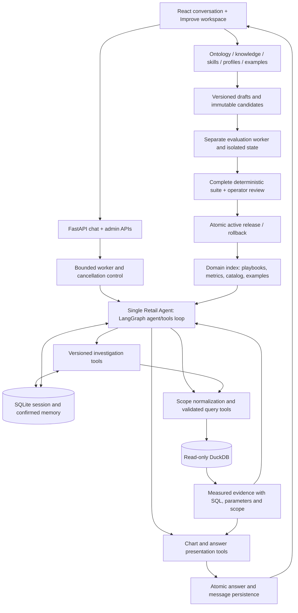
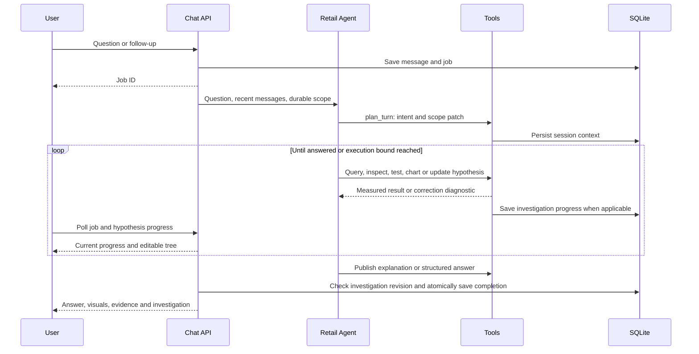
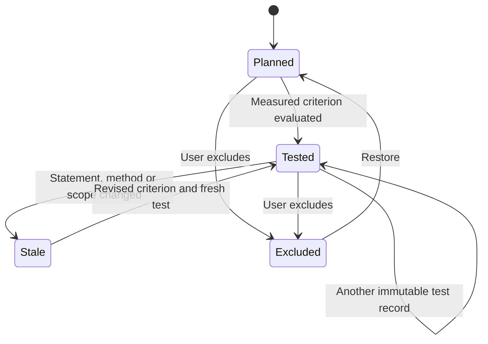

# Milky Way 2.0 — implemented architecture

For the full developer package, see the [handbook](developer/README.md), [expanded architecture and diagrams](developer/ARCHITECTURE.md), [low-level design](developer/LOW_LEVEL_DESIGN.md), and [API/tool reference](developer/API_AND_TOOLS.md). This page remains the concise architecture overview. The [approved improvement plan](developer/UI_IMPROVEMENT_PLAN.md) is implemented in application release 2.1.0; see the [user/admin guide](developer/USER_ADMIN_GUIDE.md) and [registry/evaluation design](developer/IMPROVEMENT_WORKSPACE_DESIGN.md).

The app has one conversational Retail Agent. It selects data/context lookup, parameterized queries, playbooks, visualization, EDA/statistics or persistent hypothesis investigation as tools within the same LangGraph loop. There is no required user mode switch or specialist handoff.

## Agent loop and evidence

`agent.py` owns the model/tool loop. `conversation.py` adds `plan_turn`, `query_retail`, investigation tools, preference saving and brief explanations. The model selects a response type from meaning and context; it can change course as evidence arrives. `plan_turn` updates normalized session scope. Definitions finish through `answer_explanation`; measured analytics use `present_answer` with source-bound charts and tables.

`scope.py` resolves allowed dimensions/operators and binds filter values. `query_retail` handles common measures with correct sale-line/cohort grains and distinct order/customer counts. `query_scoped_sql` accepts model SELECTs over an injected `scoped_sales` relation; its parser rejects physical-table bypasses, table functions and source shadowing. Filters and dates are bound by the application. Custom formulas, observational assumptions and join cardinality still require review.

`E#` labels refer to measured results in the current answer. `D#` labels refer to retrieved document sources. On resumption, saved test evidence is loaded with new `E#` references and its investigation/node/test origin. Existing evidence cannot be relabeled after scope changes. SQL and currency checks reduce specific failure modes; they do not constitute a complete semantic or causal proof.

## Investigation lifecycle

`investigations.py` owns session records, investigation snapshots, revision events and immutable test history. Each hypothesis has a stable ID/parent, statement, method, falsifier, declared numeric criterion, scope, status, evidence and interpretation. A deterministic evaluator compares a selected measured cell against its prespecified threshold. Supported/contradicted describes the predicate under its scope, not a causal verdict. The agent must declare a usable criterion before executing a test, including after a user edit. Missing result-column aliases and invalid row references are query errors requiring correction; genuinely empty/null results or explicitly unavailable business evidence can be data-missing.

Semantic edits clear obsolete criteria unless a revised criterion is supplied explicitly. Descendants and ancestor summaries are invalidated when their dependencies change. A scope change invalidates existing test findings and baseline. Optimistic revisions reject obsolete workers; the edit API requests cancellation before an old answer can publish. Continue/retest operates on the current snapshot. Incomplete investigations survive restart, but a running provider request is not resumed at an instruction-level checkpoint.

## Local runtime and boundaries

One Uvicorn process binds `127.0.0.1:8766`. Two admitted analyses share a two-worker pool. Jobs retain cancellation and five-minute execution controls; model turns are bounded by response type. DuckDB is read-only, with external access disabled, bounded rows/bytes/time and narrow model-SQL checks. SQLite stores conversations, analyses, feedback, confirmed memory, sessions, investigation revisions and test evidence. The new macOS LaunchAgent is `com.milkyway.retailagent.v2`.

Questions, relevant context, bounded evidence previews and recent conversation context are sent to the configured OpenAI Responses API. The browser communicates with the local app; its bundle does not contain the API key. The service is designed for a trusted local user, with no public multi-tenant authentication or cloud uptime guarantee.

## Improvement workspace (2.1.0)

The local admin UI has five sections: Knowledge & ontology; Skills; Answer design & examples; Evaluations; Feedback & releases. The SQLite registry initially imports 53 built-in assets: 26 source references, four concepts, nineteen skills, three output profiles and one 76-case runtime suite. All built-ins are read-only; custom drafts are created or duplicated and validated. Stable slug-to-chapter mapping preserves original recipes when reference ordering changes.

Each question captures its active immutable release before admission. Retrieval, skill/profile context, source hashes and final answer provenance use that snapshot. The Why this answer drawer and editable scope controls expose the relevant state. Changing a published release cannot change a running answer. Draft and candidate previews remain separate from active chat.

A separate single-worker evaluation queue compares frozen baseline/candidate versions, persists outputs and review, and isolates conversations/memories through context-local temporary state. Full foundation checks, exact hashes, review and hard failures gate publishing. Explicitly opted-in live evaluations are bounded and billable; their semantics need review. This delivery does not claim a completed enterprise live-quality benchmark. Restore moves the active pointer to a previously published release while retaining history.
