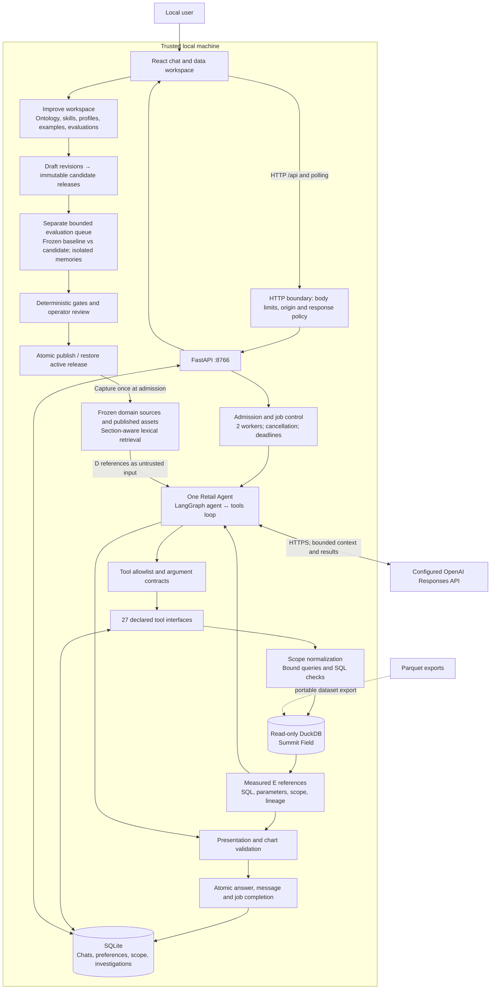
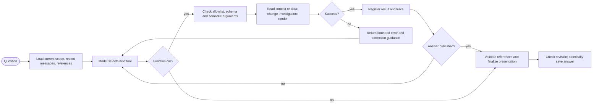
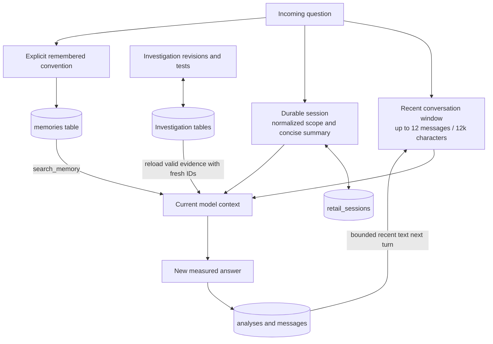
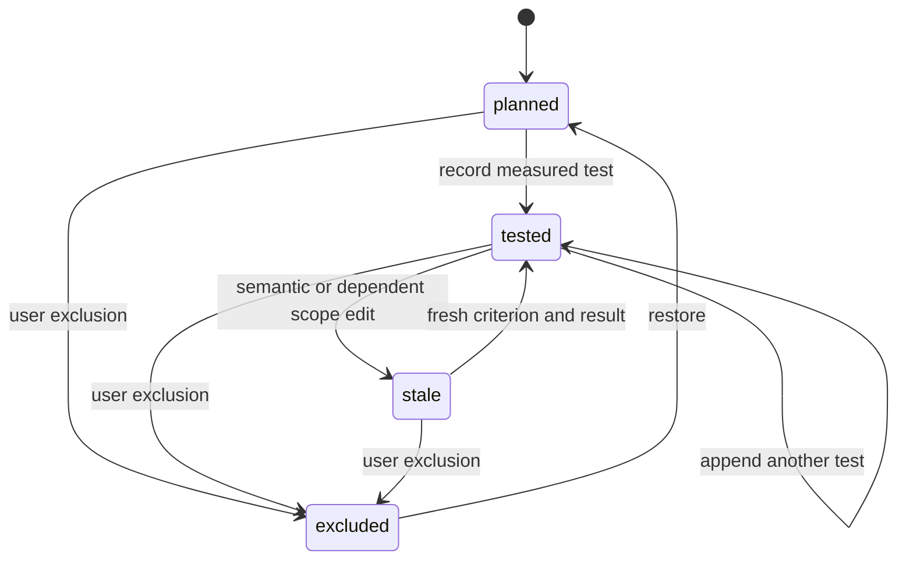

# Implemented system architecture

[Handbook](README.md) · [Low-level design](LOW_LEVEL_DESIGN.md) · [Feature status](FEATURES.md)

## System context and deployment

The browser is a presentation and local administration client. FastAPI serves the static frontend and owns the application APIs. One Uvicorn process hosts two admitted analysis workers, a separate single-worker evaluation queue, a built-in document index, immutable workspace snapshots and local persistence adapters. The Retail Agent calls the configured OpenAI Responses API and receives tool selections. The backend executes those tools and returns bounded results to the model. Application release 2.1.1 hardens the versioned improvement workspace; it retains the Milky Way 2.0 product name.




The Parquet export is a portable representation of the warehouse, not an additional live query service used by the chat agent. The synthetic generator runs separately from the analysis application. No model-selected code writes to DuckDB. SQLite is writable because answers, conversation state and investigations must persist.

Source: [main.py](../../backend/main.py), [agent.py](../../backend/agent.py), [data.py](../../backend/data.py), [storage.py](../../backend/storage.py), [runtime.py](../../backend/runtime.py).

## Component responsibility map

| Layer | Components | Responsibility | Important boundary |
|---|---|---|---|
| Conversation UI | `chat.jsx`, `api.js`, `chat.css` | Submit questions, poll jobs, show progress and scope, manage conversations | No provider credential; no direct SQL/database connection |
| Investigation UI | `investigation.jsx` | Edit/add/exclude/restore hypotheses and continue testing | Sends expected revision; does not calculate verdicts |
| Improvement UI | `improve-workspace.jsx`, `workspace/`, `improve.css` | Five admin sections, guided authoring, previews, comparison, feedback and releases | Drafts do not affect normal answers; operator names are local audit labels |
| Answer UI | `answer-report.jsx`, `playbook-charts.jsx`, `evidence.jsx`, `chart-table.jsx` | Render seven answer sections, measured charts, tables and next questions | Renders saved evidence; cannot make missing observations exist |
| HTTP boundary and guide | `http_boundary.py`, `guide_api.py` | Bound intake bytes/time, apply security/cache headers, serve documented public references | No private state/secret downloads even if linked by a document |
| Application API | `main.py` | Validate requests, admit jobs, dispatch operations, expose durable state | Local trust checks are not public authentication |
| Agent orchestration | `agent.py`, `conversation.py`, `tool_contracts.py` | Prepare context, call model, execute tools, correct errors, publish | One active primary agent; bounded graph and provider calls |
| Domain context | `context.py`, allowlisted files | Retrieve relevant sections with role, path, lines and hash | Reference text is not executable authority or fresh query evidence |
| Semantic query layer | `scope.py`, `sql_checks.py` | Validate dimension/metric names, bind scope, catch selected SQL mistakes | Arbitrary formula and join semantics still require review |
| Data/analysis | `data.py`, `analytics.py`, `hypotheses.py`, recipe runner | Read warehouse, execute recipes and measured statistical operations | Stock snapshots, cohort measures and transactions retain distinct grains |
| Evidence/presentation | `evidence.py`, `presentation.py`, `visual_data.py` | Reference IDs, arithmetic, numeric substitution, visual contracts | Existence/shape checks do not prove every narrative claim |
| Persistence | `storage.py`, `investigations.py` | SQLite transactions, history, revisions, immutable tests | Not a distributed queue or instruction-level model checkpoint |
| Workspace registry | `workspace_assets.py`, `workspace_api.py` | Baseline migration, validated drafts, immutable versions/releases, activation history and feedback | Known tools/handlers and data mappings only; no uploaded executable code |
| Runtime bridge | `workspace_runtime.py` | Freeze release, retrieve exact source versions, select methods/profile, attach answer provenance | Supplied evaluation snapshot never resolves the active workspace mid-run |
| Evaluation service | `workspace_evaluations.py`, `evaluation_api.py` | Persist bounded jobs, execute runtime contracts/live cases, compare, review and gate release | Expected outcomes excluded from model context; deterministic passes do not certify narrative semantics |
| Operations | `start.sh`, `service.py`, `maintenance.py`, Docker files | Local startup/service, backup, packaged deployment configuration | Container execution and public operations need their own acceptance |

## The reasoning loop



The graph has `agent` and `tools` nodes. An agent response with function calls routes to the tools node. A published explanation or structured presentation ends the graph. Otherwise tool results return to the model. The request uses `parallel_tool_calls: false`; the local tool dispatcher also guards against more than four calls in one received output batch. There is no independent planner service, verifier agent, vector service or durable LangGraph checkpointer.

The high-priority instructions contain static application behavior and safety rules. Model-visible reference material, schema/labels, retrieved excerpts, editable skills/profiles, prior conversation and durable memory are passed as lower-priority reference input. References cannot authorize tools or override the application policy. The current durable session and investigation are refreshed as reference input for subsequent model calls. `plan_turn` is forced first for saved conversations. Investigation turns can be steered toward executing pending hypothesis tests rather than endlessly planning them.

## Context layers and the earlier architecture reference

| Earlier context concept | Current implementation | What is absent |
|---|---|---|
| Dataset usage | Catalog, table/view inspection, query examples, retail routing guidance | Historical SQL usage telemetry, popularity and production dashboard lineage |
| Human annotations | Curated definitions plus ontology/knowledge forms, aliases, mapping validation, immutable releases and operator review | Authenticated SME roles, enterprise stewardship assignments and effective-date policy |
| Code enrichment | Indexed generator, catalog, validator, report code, DDL and views | Automated ingestion of enterprise repositories or production transformation schedules |
| Institutional knowledge | Retail playbooks, visual specifications, worked examples and reference notes | Live external knowledge connectors and a verified business-event chronology |
| Memory | Explicit conventions plus durable conversation scope/summary and investigations | Learned policy promotion, semantic memory search, unlimited transcript recall |
| Runtime context | Live schema, bounded samples, profiles, scoped queries and measured evidence | Remote warehouse federation or live operational ingestion |

The built-in index is built in process from an explicit `FILES` list of 26 source documents. Search combines lexical relevance, retail aliases and asset roles. Markdown sections preserve heading breadcrumbs; catalog/JSON records preserve their logical identity. Duplicate playbook excerpts are suppressed. The registry's initial migration freezes these source bodies/chunks with their hashes. Runtime search uses the captured release's frozen sources and published custom assets, preserving source identity across later file edits and restarts. Normal retrieval returns six results; bounded snippets and character limits apply. Candidate preview searches a separate snapshot. Evaluation suite cases and expected outcomes are excluded from model-visible retrieval. A restart rebuilds the developer file index but does not rewrite existing immutable workspace releases.

## Administrator and release lifecycle

```mermaid
sequenceDiagram
    participant Admin as Local administrator
    participant UI as Improve workspace
    participant Registry as SQLite registry
    participant Eval as Evaluation worker
    participant Chat as Chat admission / Retail Agent
    Admin->>UI: Create or duplicate asset; save expected revision
    UI->>Registry: Validate draft and dependencies
    Admin->>UI: Preview retrieval or measured answer fixture
    UI->>Registry: Freeze candidate version map
    UI->>Eval: Compare baseline and exact candidate
    Eval->>Eval: Isolated state; deterministic checks; optional bounded live cases
    Eval->>Registry: Persist outputs, failures, coverage and provenance
    Admin->>UI: Review applicability and record decision
    UI->>Registry: Publish with evaluation ID and expected active release
    Registry->>Registry: Recheck gates; atomically activate
    Chat->>Registry: Capture active immutable snapshot once
    Chat->>Chat: Retrieve, query, apply profile; save version provenance
    Admin->>Registry: Restore a previously published release
    Note over Chat,Registry: Existing and running answers retain their captured versions
```

The five admin sections support knowledge/ontology, skills, answer design/examples, evaluations, and feedback/releases. A skill is an instruction/method asset for the single agent, with a supported handler and approved-tool references. The nineteen original recipe calculations remain code-owned. Custom terminology can map to approved measures/fields; it cannot add a missing column or a new formula engine. Output profiles change presentation preferences while preserving scope, units, measured evidence and limitations.

The release gate requires a complete bundled deterministic suite for the exact candidate, unchanged core contracts, passing hard checks, current code/data provenance and an approved operator review. Candidate-specific cases and coverage warnings identify what the foundation does not prove. Optional live runs use explicit billable consent and human review; no model judge or general enterprise answer-quality certification is supplied. [Technical design](IMPROVEMENT_WORKSPACE_DESIGN.md) documents exact limits and schemas; [User/admin guide](USER_ADMIN_GUIDE.md) gives the interaction steps.

## Workspace persistence versus conversation memory

Workspace assets and releases are shared configuration for the local application. They are not remembered model facts, generated warehouse observations or changes to model weights. `workspace_versions` and `workspace_releases` have immutable-record triggers. Mutable draft revisions, active release and activation audit are separate tables. Evaluations use temporary execution state through a `ContextVar`, so a test's saved preference cannot leak into user memories or a concurrent chat. Run summaries/evidence persist in the normal workspace database for review.

## Memory and lifetime



These stores have different semantics. A summary carries conversation intent but is not evidence. A preference is an explicit user convention but cannot override source metric truth. An investigation's valid saved evidence can be reused with an origin record and new answer-local `E#` IDs. Editing scope or a hypothesis invalidates affected findings; it does not rewrite immutable previous test records.

Memories are global to this local application, not tenant-scoped. Deleting a chat removes chat-owned messages, answers, feedback and investigation state; it does not automatically delete global saved conventions. Memory retrieval is SQLite `LIKE` with a maximum of thirty recent matches.

## Investigation lifecycle and user corrections

```mermaid
sequenceDiagram
    participant U as User / React
    participant API as Chat API
    participant A as Retail Agent
    participant Q as Scoped query tools
    participant S as SQLite
    U->>API: Ask why a metric changed
    API->>S: Save question and running job
    API-->>U: Conversation ID and job ID
    API->>A: Question + durable scope
    A->>Q: Verify baseline with plan_turn
    Q-->>A: Measured baseline
    A->>S: Create/resume investigation
    A->>S: Save hypotheses and numeric criteria
    A->>Q: Execute each scoped test
    Q-->>A: Evidence and SQL
    A->>S: Compute verdict; append immutable test
    U->>API: Edit H1 with expected revision
    API->>S: Save edit; invalidate affected results
    API->>A: Request cancellation of old worker
    U->>API: Continue / retest
    API->>A: Latest snapshot and user correction
    A->>S: Save fresh criterion for edited H1
    A->>Q: Rerun affected test
    A->>S: Save new result and final answer
    API-->>U: Updated answer and editable tree
```



`status` describes a node's lifecycle; `verdict` describes its measured result. A tested node may be `supported_descriptively`, `contradicted`, `inconclusive` or `data_missing`. Declared `testing` status is supported by the data model, but the synchronous testing path should not be assumed to publish a separate observable testing event for every query. Investigation-level state is distinct again: `active`, `complete`, `incomplete`, `paused` or `superseded`. The tool accepts `partial`, which persistence normalizes to `incomplete`.

## Evidence and answer flow

1. A query creates full bounded rows, SQL, parameters and scope. The model sees a smaller preview; the saved answer retains the full bounded result.
2. A result is assigned an answer-local `E#`. Retrieved documents receive `D#` references with file locations.
3. Calculations reference measured cells. They become derived evidence with their source IDs.
4. Chart specifications identify evidence and existing columns. Validation checks shape, numeric fields, series uniqueness and selected unit compatibility.
5. Narrative tokens such as `{{E1:0:sales_cents}}` resolve directly to measured values. `_cents` becomes USD, and `_pct` becomes a percentage.
6. Structured presentation requires scope, metric basis, interpretation, limitations, next questions and supporting evidence IDs. The UI inserts the visual and supporting values between scope and interpretation.
7. Completion checks the current investigation revision and commits analysis, assistant message and job completion atomically.

## Trust and failure boundaries

The browser has neither the provider key nor a database handle. The backend accepts local hosts, checks write origins and an app header, caps request bodies, sends restrictive response headers and exposes generic internal-error messages. These are local application controls; there is no login, authorization model or tenant isolation.

Model inputs include question text, relevant documentation, recent context and bounded result previews. Requests set `store: false`; that request option should not be treated as a complete statement of provider retention policy. The application keeps local evidence and answer history in SQLite. Secrets are loaded server-side from supported environment settings and an ignored `.env` file.

Database access is read-only with external access disabled, SQL/parser checks and row/byte/time limits. These reduce specific execution and semantic failure modes. They do not make every SQL expression, business claim or causal conclusion correct. A tool error is returned to the model for correction; it is not relabeled as a successful empty result.

Restart preserves completed chats and investigation progress. It marks running chat jobs interrupted. It does not restore an in-flight provider call or the graph's exact execution point. Distributed workers, public deployment and full execution checkpointing are missing capabilities documented in [Features](FEATURES.md).

## Local hardening and browser loading

The chat entry downloads its shared renderers and controls. Administration and the analysis workspace load through deferred ES modules when opened. Content-addressed chunks are cacheable; entry scripts, API responses and private exports use `no-store`. A failed module download offers a reload path. The build validates imports and includes all required chunks in `static/`; copying `app.js` alone is not a deployable frontend.

HTTP intake limits normal bodies to 64 KiB and workspace bodies to 768 KiB, including chunked uploads, with a ten-second body deadline. The packaged guide only serves linked public references and caches its link inventory until documentation metadata changes. Correlation IDs accompany sanitized failures; question text and raw provider errors are excluded from error logs.

See [OpenAI guidance and local readiness](PRODUCTION_READINESS.md) for control mapping, verification and deployment boundaries.
