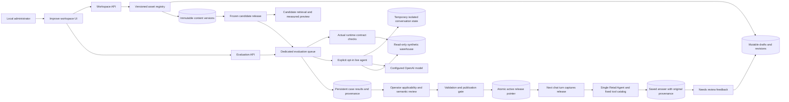

# Improvement workspace: implemented developer design

[Handbook](README.md) · [Architecture](../MILKY_WAY_2_ARCHITECTURE.md) · [Extension guide](EXTENDING.md)

This chapter documents the local improvement workspace implemented in this Milky Way 2.0 folder. It covers versioned knowledge and ontology, skill manifests, output profiles and examples, evaluation runs, feedback, publication and rollback. The administrator is the trusted person operating this local application. An operator label records who performed an action; it is not authenticated identity or an independent approval authority.

## Runtime architecture



The workspace extends the existing single Retail Agent. It does not introduce an agent that can install arbitrary code. Built-in playbook calculations remain implemented in Python. User-authored skill methods can describe how to use the approved tools and supported handlers. Declared tool names are validated against the actual catalog. The runtime still owns tool permissions.

Each chat turn receives a deep copy of one release snapshot. `workspace_runtime.capture()` accepts an already frozen snapshot for evaluation or captures the active release for ordinary chat. `workspace_runtime.search()` and `settings()` route retrieval, skill selection and output-profile choice through that snapshot. Publication during a running answer does not replace its captured content.

## Module responsibilities

| Module | Responsibility |
|---|---|
| `backend/workspace_assets.py` | SQLite registry, schema bootstrap, built-in import, content validation, optimistic draft edits, frozen snapshots, release activation, feedback and source lookup |
| `backend/workspace_api.py` | Local administrator endpoints; structured errors; measured output-profile preview |
| `backend/workspace_runtime.py` | Release capture, frozen retrieval and settings, source/skill/profile provenance attached to answers |
| `backend/workspace_evaluations.py` | Dedicated bounded worker, persistent runs, deterministic contracts, live state isolation, comparison, human review and release gate |
| `backend/evaluation_api.py` | Evaluation suite listing and run/start/poll/cancel/review routes |
| `backend/storage.py` | Main SQLite connection and `ContextVar` state-directory override for isolated workers |
| `backend/agent.py` | Single agent loop; frozen workspace snapshot; live model-call and token reservations |
| `backend/presentation.py` | Evidence-bound answer and chart checks; output-profile display settings |
| `knowledge/enterprise_evaluations.json` | The initial 76 concrete deterministic regression cases |
| `workspace_assets.BUILTIN_SKILLS` | Stable built-in playbook IDs and mappings used by the registry |
| `tests/test_workspace_evaluations.py` | Lifecycle, isolation, grading, candidate comparison and publication-gate regression tests |

## Persistence and invariants

All administrator records and evaluation results use the existing `state/app.sqlite3`, or the directory selected by `RETAIL_STATE_DIR`. A backup of that database includes registry versions, activation history, feedback and evaluation runs. The warehouse remains a separate read-only DuckDB file.

| Table | Important columns and behavior |
|---|---|
| `workspace_migrations` | Applied migration version and timestamp; bootstrap imports existing reference assets once |
| `workspace_assets` | Stable `id`, `kind`, name, owner label, built-in flag and creation time |
| `workspace_drafts` | One draft per asset; content, name, monotonic `revision`, updated time |
| `workspace_versions` | Immutable version ID, asset ID, schema version, content JSON and SHA-256 content hash |
| `workspace_releases` | Immutable full asset-to-version mapping, parent release, snapshot hash, validation receipt and operator/rationale |
| `workspace_active` | Singleton active-release pointer |
| `workspace_activations` | Publish/rollback history, previous release, operator/rationale and evaluation run ID |
| `workspace_feedback` | Original answer and question, issue types, correction, original provenance/evidence, status/revision and linked asset/case |
| `workspace_evaluation_runs` | Run ID, status, timestamps and JSON payload containing pinned snapshots, suite, case results, provenance, usage, coverage and review |

SQLite triggers reject update or deletion of content-version and release rows. Drafts use `expected_revision`; a stale edit receives a conflict instead of overwriting another edit. Publication and rollback use `expected_active_release_id`, and activation is transactional. A candidate release contains a complete compatible version set, not only changed records.

`candidate_snapshot()` freezes current drafts into immutable versions without activating them. A stored release is then created from that mapping. `capture_snapshot(release_id=...)` loads a known release; `candidate_version_ids` can select exact versions for an evaluation. The evaluation stores copies of both snapshots and the suite content so subsequent draft edits cannot change the run.

Built-in reference sources retain frozen indexed chunks, role labels, source hashes and citation locations. Evaluation suites are excluded from retrieval. Model-visible versions of reference assets remove evaluation metadata. `model_snapshot()` also removes evaluation-suite/case assets before any live evaluation invokes the agent.

## Administrator and developer interaction

The intended administrator loop is:

1. Create or edit a draft in Knowledge & ontology, Skills, Answer design or Evaluations.
2. Validate the draft. Read field-level errors for missing measures, concepts, tools, handlers, profiles or conflicting aliases.
3. Preview candidate retrieval or a measured output design; verify the relevant source is selected and the displayed values are unchanged.
4. Create a candidate release. Run the full Enterprise runtime contracts suite against its frozen ID. Add candidate-specific cases for the changed business behavior.
5. Inspect baseline/candidate results, failed checks, changed sources and the declared coverage report.
6. Record an operator review with applicability notes. Live results additionally require human judgment of the actual answer's semantics.
7. Publish with the reviewed run ID and the expected active release ID. New chat turns use it; older answers keep their original provenance.
8. If needed, roll back to a previously published release. Database migration rollback and application deployment rollback are separate operations.

A new business term with no physical data mapping can be documentary knowledge. An executable metric must map to an approved measure and declare units, sale-date basis and a supported return basis. Adding a description never creates a new warehouse column or new executable calculation. Unsupported handlers or operations require a developer to implement and test an adapter.

A feedback conversion creates a draft regression case. The original question, answer, evidence and version provenance remain attached to the feedback record. An expected result must be supplied and reviewed before that case can pass validation. Converting feedback does not modify active knowledge or train the model.

## API contracts

All paths below use the application-level local-origin and `X-Retail-App: local` mutation protection. The application binds to loopback. JSON errors from these routers have `detail.code`, `detail.message` and, where applicable, field-level errors. Request models reject unrecognized properties. Evaluation numeric limits use strict integers; booleans do not count as a case budget.

| Method and path | Purpose |
|---|---|
| `GET /api/workspace/status` | Active release, draft count, kind counts and capabilities |
| `GET /api/workspace/capabilities` | Supported measures, fields, date/return bases, tools and handlers |
| `GET /api/workspace/assets?kind=...&q=...` | Search assets |
| `POST /api/workspace/assets` | Create `{id?,kind,name,content,owner?}` draft |
| `GET /api/workspace/assets/{id}` | Asset, current draft and published-version information |
| `PUT /api/workspace/assets/{id}` | Edit `{content,expected_revision,name?}` |
| `GET /api/workspace/assets/{id}/versions` | Immutable content-version history |
| `POST /api/workspace/assets/{id}/validate` | Validate a draft in a candidate snapshot |
| `POST /api/workspace/preview` | Retrieve `{query,asset_ids?,limit?}` against a candidate |
| `GET /api/workspace/sources/{asset_id}/{version_id}` | Inspect an exact version source |
| `GET/POST /api/workspace/releases` | List releases or create a candidate with optional asset selection/name/rationale/operator |
| `GET /api/workspace/releases/{id}` | Frozen release and validation receipt |
| `POST /api/workspace/releases/{id}/publish` | Activate after validation and evaluation; requires expected active ID and evaluation run ID |
| `POST /api/workspace/releases/{id}/rollback` | Return to a prior published release with expected active ID |
| `GET /api/workspace/output-profiles` | Published profiles |
| `POST /api/workspace/output-preview` | Query a measured `monthly-sales` or `channel-sales` fixture and apply the candidate profile |
| `GET/POST /api/workspace/feedback` | List feedback or retain an answer for review |
| `PUT /api/workspace/feedback/{id}` | Revision-checked triage/correction |
| `POST /api/workspace/feedback/{id}/convert` | Create or extend an evaluation-suite draft |
| `GET /api/evaluations/suites` | Published suite content, categories, counts, validation errors and service limits |
| `POST /api/evaluations/runs` | Start a frozen baseline/candidate comparison |
| `GET /api/evaluations/runs` | Latest 100 run summaries |
| `GET /api/evaluations/runs/{id}` | Persistent progress, both-side results, differences, checks, provenance, coverage and review |
| `POST /api/evaluations/runs/{id}/cancel` | Request cooperative cancellation |
| `POST /api/evaluations/runs/{id}/review` | Record `{reviewer,decision,notes}`; decision is `approved` or `rejected` |

A normal deterministic request is:

```json
{
  "suite_id": "enterprise-core",
  "baseline_release_id": "<existing active release ID>",
  "candidate_release_id": "<created candidate release ID>",
  "mode": "deterministic",
  "max_cases": 120,
  "max_model_calls": 0,
  "max_tokens": 0,
  "confirm_billable": false
}
```

Replace the two placeholder IDs with returned release IDs. The 120 case cap includes all 76 initial core cases. A smaller cap is useful for a smoke test but cannot authorize a release unless it includes every required core and applicable case. `candidate_version_ids` is an alternative to a stored candidate ID. When neither candidate input is supplied, the candidate is the active snapshot; it does not silently include drafts.

## Dedicated evaluation execution

The evaluation executor has **one worker and at most four admitted runs**, including queued runs. Chat retains its separate executor. Evaluation queries still share the bounded warehouse connection semaphore with chat; separate queues do not reserve exclusive CPU or database capacity.

Runs move through `queued → running → completed`, or end in `cancelled`, `failed` or `interrupted`. The cancel response can report `cancelling` while the worker reaches its next cancellation boundary. The worker owns durable progress to prevent a cancellation request from overwriting freshly completed results. Cancellation does not undo completed cases. Startup recovery marks unfinished stored runs `interrupted`; it does not automatically repeat billable work. A retry is a new run with a new ID.

A run has a 15-minute cooperative deadline. The existing per-query and provider request timeouts still apply. Cancellation is checked between cases, between baseline and candidate, by warehouse controls and around model calls. It cannot immediately abort an already in-flight provider request.

Each run captures:

- baseline/candidate release IDs, snapshot hashes and exact content-version mappings;
- suite version/hash and the selected case IDs;
- current Python code hash and built-in context hash;
- warehouse path, size, modification time and an identity hash;
- model name for live runs, grader version, case/token/call limits and explicit billable consent;
- completed case results, evidence/source metadata, usage totals, coverage and review.

The warehouse identity is explicitly a size/mtime identity, **not a full database content checksum**. The service checks code/context/warehouse identity before and after each comparison side and again at publication. It does not clone the entire warehouse. Replacing the file while preserving both size and modification time is outside this identity check.

Live evaluation creates a temporary directory and uses `storage.use_state()` with a `ContextVar` override. An isolated conversation is created there, with optional validated starting scope and prior context. Memories, investigations and saved conversation changes stay in that temporary database. The normal `storage.STATE` global is never reassigned. The directory is removed after the side finishes. Persistent evaluation results are written only after leaving that temporary override.

## Live budgets and semantic review

Live mode is opt-in and billable. It requires `confirm_billable: true`, a configured key/model, at least two model calls for a two-sided comparison, and at least 2,000 tokens. The service maximum is 40 provider requests and 200,000 tokens per run. Input size may require a much larger allowance than the minimum; a small budget can fail before dispatch.

The agent reserves a conservative input allowance from UTF-8 request bytes plus the bounded requested output before dispatch. Confirmed usage reconciles that reservation. An unknown provider/transport outcome retains its reservation. Retries consume the request cap and carry their token reservation forward. The run carries request, input, output, total and reserved-token counters across both sides and all cases. These are protective upper bounds and receipts, not a monetary price quote.

Live cases apply deterministic checks to the actual returned answer, structured scope, measured tables, citations and version provenance. The evaluation additionally verifies that cited IDs exist and that the answer reports the pinned snapshot hash. Structured runtime evidence errors, sanitized unverified-reference markers and monetary-mismatch warnings remain hard failures after the agent has sanitized its displayed answer. Those checks cannot decide whether every claim is well supported, whether a causal explanation is valid, or whether the prose is useful. A human must read the answer and evidence before approval. No model-based semantic grader is implemented or represented as authoritative.

## Initial 76-case suite

The initial cases are **code-authored and checked against runtime contracts**. `review_status: code_reviewed` does not assert review by a domain expert. Live narrative quality and causal judgment remain untested until an operator runs and reviews suitable live cases.

| Category | Cases | Coverage |
|---|---:|---|
| Legacy playbooks | 19 | Required methods, guardrails, sources and visual/answer contracts for every built-in playbook |
| Metrics | 6 | Supported alias normalization without unit drift |
| Return basis | 3 | Explicit original-sales, cohort and calendar basis normalization |
| Entity resolution | 3 | App/Web/POS aliases against actual channel labels |
| Adverse scope | 10 | Unknown fields/metrics/entities, invalid dates, keys, booleans and unsupported properties |
| Multi-turn | 3 | Explicit filter clearing, channel correction and comparison invalidation after a date change |
| Retrieval | 8 | Metric, causal-data-gap, return-tail, maturity, physical schema, visual, validation and worked-example source roles |
| Query safety | 8 | Actual SELECT results, channel/sales coverage, write/multiple-query rejection, disconnected joins, header fan-out and duplicate columns |
| Evidence | 3 | Measured/document references and fabricated-reference labeling |
| Response quality | 5 | Cents/units formatting, unavailable measured tokens, answer structure and monetary-claim rejection |
| Reconciliation | 2 | Arithmetic on measured cells and rejection of invented supplied comparisons |
| Visual consistency | 6 | Real evidence columns, numeric axes, compatible units, supported chart kind and source IDs |

These checks do not replace the existing numerical playbook regression suite. In particular, verifying a playbook's declared method/visual contract does not recompute every playbook's sales and margin golden totals.

## Authoring a case

A suite is an `evaluation_suite` asset with `description`, `review_status` and `cases`. Each case has a stable unique ID, question, category, mode, contract inputs and expected checks. Optional `asset_ids` declares which changed assets it is intended to cover. The declared relationship is visible during review; it is not automatic proof that the checks assess every part of that asset.

Supported deterministic contract types call existing runtime functions:

| Contract type | Actual operation |
|---|---|
| `scope` | `normalize_scope(candidate, previous, dates)` |
| `retrieval` | The same frozen workspace search used by chat |
| `query` | Read-only guarded `select_sql(sql, parameters, limit)` |
| `chart` | Evidence-bound `validate_chart(spec, evidence)` |
| `presentation` | Structured `validate_presentation(presentation, evidence)` |
| `citations` | `check_citations(answer, evidence, sources)` |
| `measured_values` | `bind_measured_values(text, evidence)` |
| `comparison` | `comparison_from_evidence(arguments, evidence)` |
| `playbook_contract` | Stable `get_contract(slug)` |
| `workspace_profile` | Apply the selected frozen profile to a supplied measured payload |
| `workspace_skill` | Select skills and settings from the frozen snapshot for the stated question |
| `live_answer` | Opt-in real `run_agent` invocation in isolated temporary state |

Expected checks support `equals`, `contains`, `not_contains`, `min_length`, `required_source_roles` and `error_contains`. Paths use dot notation, including zero-based list indices: `outputs.0.rows.0.sales_cents`. Contains checks are case-insensitive textual checks over serialized selected values; they are not a language-model semantic judgment. `error_contains` proves that the actual runtime rejects an input with the specified error. Missing and empty grading contracts fail validation.

### Retrieval example

After creating an ontology/knowledge asset with ID `allocation-promise`, add this deterministic case to an evaluation suite:

```json
{
  "id": "allocation-promise-retrieval",
  "name": "Retrieve the approved allocation definition",
  "question": "What does allocation promise mean?",
  "category": "retrieval",
  "mode": "deterministic",
  "asset_ids": ["allocation-promise"],
  "contract": {
    "type": "retrieval",
    "inputs": {"query": "allocation promise", "limit": 6}
  },
  "expected": {
    "contains": {
      "sources": ["allocation-promise"],
      "text": ["not actual delivery"]
    }
  },
  "requires_human_review": false
}
```

The baseline can legitimately fail while the candidate passes because only the candidate contains this new definition. The result shows an improvement and changed source provenance. The text check proves retrieval of a specific caveat, not the correctness of a generated explanation.

### Output-profile example

This case verifies a known quick profile against an explicit measured fixture. To test a custom profile, replace `quick-answer` with its stable ID and set the expected display preference accordingly.

```json
{
  "id": "quick-profile-preserves-values",
  "question": "Show a concise measured answer with evidence retained.",
  "category": "output_design",
  "mode": "deterministic",
  "asset_ids": ["quick-answer"],
  "contract": {
    "type": "workspace_profile",
    "inputs": {
      "profile_id": "quick-answer",
      "payload": {
        "answer": "Measured sales are available in E1.",
        "outputs": [{"evidence_id": "E1", "rows": [{"sales_cents": 12345}]}],
        "warnings": ["Synthetic fixture; no causal claim."]
      }
    }
  },
  "expected": {
    "equals": {
      "output_display.table_rows": 5,
      "outputs.0.rows.0.sales_cents": 12345
    },
    "contains": {"presentation.limitations": ["Synthetic fixture"]}
  }
}
```

The fixture value is not passed off as a warehouse finding. The separate measured UI preview runs a fresh warehouse query over a fixed January–March 2025 scope.

### Live-answer example

This case verifies explicit scope and the presence of real measured evidence. Its expected answer fields stay outside model inputs. It requires live mode and operator review after execution.

```json
{
  "id": "live-web-sales-scope",
  "question": "What were Web sales before returns for January 2025? Show measured evidence and state the scope.",
  "category": "live_scope",
  "mode": "live",
  "requires_human_review": true,
  "contract": {
    "type": "live_answer",
    "inputs": {
      "dates": {"start": "2025-01-01", "end": "2025-01-31"},
      "scope": {
        "metric": "sales_cents",
        "return_basis": "before_returns",
        "filters": [{"field": "channel", "values": ["Web"]}]
      },
      "output_profile_id": "business-review"
    }
  },
  "expected": {
    "min_length": {"outputs": 1, "answer": 20},
    "equals": {
      "session_scope.return_basis": "before_returns",
      "session_scope.filters.0.values": ["Web"]
    }
  }
}
```

Use a separate suite containing live cases, or append them to a suite with deterministic cases; each run selects only its chosen mode. The supplied scope is validated and placed in the isolated conversation session before the agent starts. Add independently reviewed numeric expected values when benchmarking calculation correctness. A minimum-length check alone is not a quality claim.

## Result and release-gate semantics

Each case records baseline and candidate `status`, full or bounded output, implemented checks, failed-check descriptions, elapsed time and bounded source provenance. Results larger than 120 KB per side retain a preview, semantic hash and explicit truncation marker. A run is limited to 24 MB of persisted payload. Individual evaluation suites are limited to 256 KB and 120 cases.

Comparison distinguishes outcome changes, output changes, source changes, regressions and improvements. The structural output comparison ignores query spelling, provider usage and generated presentation timestamps, while retaining returned measured cells, scope and answer shape. It does not compare exact SQL text or claim to solve semantic equivalence of arbitrary narratives.

The publication gate requires:

1. A completed deterministic run for the exact candidate snapshot.
2. Every applicable case completed, with no candidate hard failures.
3. All 76 bundled core case IDs with their original contract inputs and expected checks; custom checks supplement this foundation.
4. Explicit operator approval with review notes. The notes should address changed assets, declared test coverage and any uncovered assets.
5. The same code, built-in context and warehouse identity as the evaluation receipt.
6. For each live suite already run against this candidate, the latest run must be completed, passing and explicitly approved by a human. This check queries the full candidate history; the UI’s latest-100-run limit cannot hide an earlier failed live suite.

A sample run, a custom one-case suite, a model score or a reviewer override of failed deterministic checks cannot satisfy those gates. Operator approval of deterministic contracts records applicability review; it does not mark live semantic quality as tested. When no live suite was run, the publication receipt explicitly says `live_answer_quality: not_tested` and `semantic_review: not_tested`.

Coverage reports list changed assets, author-declared related case IDs and uncovered assets. The operator must assess whether the available tests match the intended business change. The current local product permits an operator to approve that applicability with recorded coverage gaps; it does not claim an independent policy engine has proved semantic coverage for every change.

## Verification and remaining limits

The focused evaluation tests exercise the 76 actual bundled contracts on both sides; candidate retrieval changes; profile/evidence preservation; hidden expected data; simultaneous isolated state directories; cancellation; interruption recovery; snapshot mismatch rejection; full-suite requirements; human review gates; live budget counter propagation; and comparisons independent of SQL spelling/timestamps. They are run with:

```sh
.venv-runtime/bin/python -m unittest retail_app.tests.test_workspace_evaluations -v
```

Provider-call isolation tests substitute the provider-facing agent function; they do not incur API charges. A passing deterministic receipt does not assert a successful billable live run. Fresh full application, UI, browser and release acceptance results belong in the release notes, alongside any still-pending checks.

Additional enterprise work remains possible: independently reviewed business expected answers, stronger claim-to-evidence semantic grading, calibrated model judges, larger domain-specific suites, warehouse content-addressed snapshots, multi-process distributed execution, and authenticated multi-user approval controls. None is silently represented by the existing green deterministic checks.
