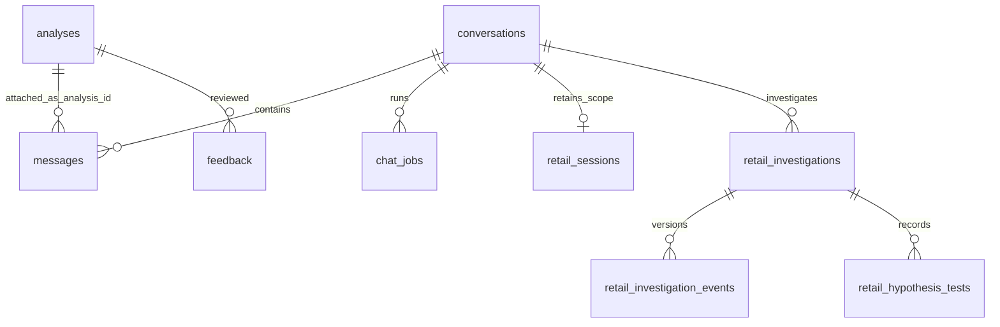

# Low-level design

[Handbook](README.md) · [Architecture](ARCHITECTURE.md) · [API/tool inputs](API_AND_TOOLS.md)

## 1. Runtime and source layout

| Source | Principal responsibilities / entry points |
|---|---|
| [main.py](../../backend/main.py) | `chat`, `submit`, `_reserve_job`, `chat_job_status`, cancellation, API validation, lifespan, local-origin middleware |
| [agent.py](../../backend/agent.py) | `run_agent`, `_run_agent`, `request_model`, tool registry, nested `agent` and `tool_step` graph functions |
| [conversation.py](../../backend/conversation.py) | `prepare_turn`, `context_for_model`, `handle_tool`, `execute_model_sql`, evidence-scope and atomic-hypothesis checks |
| [scope.py](../../backend/scope.py) | `normalize_scope`, `query_retail`, `run_scoped_playbook`, `query_scoped_sql`, `query_capabilities` |
| [context.py](../../backend/context.py) | `FILES`, `ContextIndex`, section splitting, relevance ranking, role/interpretation notes |
| [data.py](../../backend/data.py) | Paths/catalog, `warehouse_session`, `select_sql`, inspection, baseline recipe wrapper and query control |
| [sql_checks.py](../../backend/sql_checks.py) | Parse/lineage checks for selected unsafe SQL patterns, joins and header fan-out |
| [investigations.py](../../backend/investigations.py) | Session snapshots, hypothesis changes, declared-criterion evaluation, partition reconciliation, revisions and immutable tests |
| [storage.py](../../backend/storage.py) | SQLite connections, chats/messages, analyses, memory, atomic completion/deletion and restart recovery |
| [evidence.py](../../backend/evidence.py) | `E#`/`D#`, bounded history and previews, cell arithmetic, numeric binding and reference checks |
| [presentation.py](../../backend/presentation.py) | Parse playbook contracts, validate chart/presentation, finalize stored response and Markdown |
| [visual_data.py](../../backend/visual_data.py) | Additional measured datasets required by the nineteen visual designs |
| [analytics.py](../../backend/analytics.py) | Hypothesis bank search, dataset profiles and measured statistical operations |
| [hypotheses.py](../../backend/hypotheses.py) | Fixed bank hypothesis execution and supporting SQL |
| [runtime.py](../../backend/runtime.py) | Cooperative cancellation and execution deadline |
| [config.py](../../backend/config.py) | Allowlisted `.env` settings, without shell execution |

The production frontend bundles `frontend/chat.jsx` with esbuild into `static/app.js`. `frontend/app.jsx` remains the embedded data workspace and shared chart/table infrastructure. Changes to the JSX require rebuilding the bundle. Editing the compiled bundle alone is not a maintainable source change.

## 2. Chat request contract

`POST /api/chat` accepts the following relevant fields. Exact input types and constraints are in the [OpenAPI snapshot](reference/openapi.json).

```json
{
  "conversation_id": "optional-existing-conversation-id",
  "question": "Show Web Footwear sales and units for July 2025 versus July 2024.",
  "mode": "auto",
  "start": "2025-07-01",
  "end": "2025-07-31",
  "compare_start": "2024-07-01",
  "compare_end": "2024-07-31",
  "retry": false
}
```

Optional `playbook` selects a known deterministic recipe; optional `hypothesis_id` selects a known fixed bank test. They cannot both be supplied. `mode` accepts `auto` and the legacy `deep` value, but the current normal chat path invokes the same single-agent runner; a `deep` string does not deploy a separate specialist pipeline. Semantic question intent and `plan_turn` determine explanation, analysis or investigation behavior.

Requests require the local app header. Admission checks run before saving a new user message: the app must not be shutting down, at most two analyses may be active, and an existing conversation must not already have an answer in progress. An eligible retry must exactly match the last unanswered user message; it reuses that question instead of appending a duplicate.

An asynchronous accepted request returns `conversation_id` and `job_id`. The frontend polls `/api/chat/jobs/{job_id}` and reloads the conversation on completion. With no configured model and no explicit deterministic recipe, the application can synchronously return a saved suggestions answer and a conversation object. The frontend handles both shapes.

Conversation retrieval returns metadata, a bounded page of messages, any linked saved analysis payloads, pagination fields, active job, session and current investigation. The page defaults to 50 messages and permits up to 100. The backend also caps accumulated page payload size; older pages can be loaded using the returned cursor.

## 3. Jobs, locks and transactions

`ThreadPoolExecutor(max_workers=2)` performs analysis work. `JOBS` holds live status and cancellation controls. Persistent `chat_jobs` permits polling and restart recovery. The process-wide job lock is reentrant; a separate chat lock coordinates chat admission and changes. These locks coordinate one Python process only.

| State / event | Behavior |
|---|---|
| Accepted | Reserve a running slot, persist the running job, create `JobControl` |
| Progress | Update bounded progress text in memory and SQLite |
| Stop requested | Set cooperative cancellation, mark `cancelling`; provider call may finish at its timeout |
| Successful completion | Recheck cancellation and investigation revision; commit analysis, assistant message and complete job in one transaction |
| Tool-level failure | Return a diagnostic to the model; graph may correct and continue |
| Unrecoverable worker failure | Persist `error` or `cancelled`; retain saved question and earlier investigation progress |
| Durable terminal write failed | Live terminal state permits polling to reconcile persistent status when SQLite recovers |
| Server restart | Mark previously running/cancelling chat jobs `interrupted` |
| Shutdown | Reject new work, cancel active controls and stop the pool without pretending provider calls were checkpointed |

`storage.finish_chat` uses `BEGIN IMMEDIATE`. If analysis serialization, assistant-message insertion or the running-job completion condition fails, the transaction rolls back. The 1,000-message chat cap also applies during completion. Chat admission, progress updates and investigation steps are separate transactions; a complete turn is not one long database transaction. Consequently a failed turn may preserve a user question and partial investigation while publishing no final answer.

Completed entries in the in-memory job registry are pruned by age and capacity as new jobs are admitted. Durable chat history remains in SQLite. The legacy `/api/jobs/{id}` relies on the in-memory registry and is not a restart-safe history API.

## 4. Agent state and orchestration

The graph state contains `inputs`, pending function calls, evidence, trace, charts, answer text, call count, presentation, visual reports, publication status and a retained `specialists` field. A separate mutable turn structure carries the conversation ID, current question, normalized scope, original UI dates, response type, concise summary, investigation snapshot/revision and whether planning/publication has happened.

`prepare_turn` loads the session. If date controls changed from the session's last recorded UI dates, those controls update the saved scope. If they did not change, an explicit date scope established conversationally can persist. This distinction prevents unchanged date controls from undoing “same for Mobile app” or another follow-up.

Before the first model call the agent loads canonical `METRICS.md` and `MODEL.md`, ranked context snippets, a limited physical schema and actual warehouse channel/division labels. It adds bounded previous text. Every subsequent call adds the current durable scope, summary, compact hypothesis state and up to twelve recent confirmed preferences.

`plan_turn` validates a JSON scope patch and persists the result. For investigation intent it measures a baseline and creates or resumes the investigation. Common scoped totals use `query_retail`; grouping requests also obtain a separate total result, avoiding sums of overlapping distinct-order/customer groups. Explanations finish through `answer_explanation`; measured results finish through `present_answer`.

The provider request uses the configured model, the Responses endpoint, a 5,000-token output cap, `parallel_tool_calls: false`, `store: false` and encrypted reasoning content for continuation within the request sequence. This documentation does not expose private reasoning or provider credentials.

Tool dispatch first tries the conversation handler, then the core tools. Errors become a bounded error object with correction guidance and an error trace entry. Cancellation is re-raised immediately. Raw free text from the model is not evidence; references and displayed monetary amounts receive additional checks at finalization.

## 5. Execution limits

These are separate limits enforced in different layers. They are not a single shared guarantee for every operation.

| Limit | Current value / behavior | Source |
|---|---|---|
| Active analysis jobs | 2 per process | `main.py` |
| Overall job deadline | 300 seconds, cooperative checks | `runtime.py` |
| Concurrent warehouse sessions | 2; admission wait up to 5 seconds | `data.py` |
| Warehouse query time | Default 30 seconds; baseline playbook session 60 seconds | `data.py` |
| DuckDB settings | Read-only; external access disabled; 2 threads; 1 GB engine memory limit | `data.py` |
| Generic model SQL text | At most 32,000 characters and one SELECT | `data.py` |
| Generic SQL result | At most 500 rows, 100 unique columns, 1 MiB serialized row content; strings capped at 8,000 chars | `data.py` |
| Structured retail query | At most 500 returned rows; 1–24 measures and up to 8 grouping dimensions | `scope.py` |
| Scope patch | Up to 24 filters, 1–100 values per filter | `scope.py` |
| Model result preview | Normally 20 rows; lists capped at 50 entries; long strings at 6,000 chars | `evidence.py` |
| Previous conversation | Last 12 messages within 12,000 serialized characters; each long message trimmed to recent text | `evidence.py` |
| Retrieval | Normal 6 snippets; hard 12, two per source, 18,000 chars; 6,000-char chunks | `context.py` |
| Model request envelope | Rejected over 400,000 serialized characters | `agent.py` |
| Model turn budget | Response-type threshold 6 explanation / 14 analysis / 16 investigation calls; finalization allowances and shared 36/39 guards | `agent.py` |
| Provider retry | Up to 4 attempts for selected transient failures; waits bounded; quota exhaustion not retried | `agent.py` |
| Provider call timeout | At most 90 seconds and remaining job time; connect 10s, pool 5s | `agent.py` |
| Graph recursion | 90 steps | `agent.py` |
| HTTP body | 64 KiB general; 768 KiB for `/api/workspace/` writes, with tighter asset/suite content validation | `main.py` |
| Question length | Chat up to 8,000 chars; legacy ask up to 4,000 | `main.py` |
| Saved answer | 12 MiB encoded payload | `storage.py` |
| Conversation | 1,000 messages; pages up to 100 and approximately 16 MiB accumulated content | `storage.py` |
| Investigation | 80 hypotheses, 500 recorded tests; bounded JSON snapshots | `investigations.py` |

The response-type thresholds initiate finalization behavior; they are not an exact fixed number of provider HTTP attempts. Retries contribute to `usage.requests`; model graph calls contribute to `usage.model_calls`. Token counters are accumulated from provider responses. Live evaluation budgets add request-count and conservative token reservations before dispatch, including unknown-usage retries. No dollar-cost calculation exists. These evaluation limits do not add a global dollar-spending policy to ordinary chat.

## 6. Scope as a value object

```json
{
  "dates": {"start":"2025-07-01","end":"2025-07-31","compare_start":"2024-07-01","compare_end":"2024-07-31"},
  "metric": "sales_cents",
  "return_basis": "before_returns",
  "filters": [
    {"field":"channel_name","op":"eq","values":["Web"]},
    {"field":"division_name","op":"eq","values":["Footwear"]}
  ],
  "dimensions": []
}
```

Filter patches replace filters with the same field and preserve other fields. `filters: []` clears all; `remove_filters` removes named fields. Dimensions replace grouping. Changing current dates removes an older comparison unless the patch supplies a new pair. Aliases normalize field, measure and some channel names; text values with a reference table must match actual warehouse labels.

Supported operators are `eq`, `ne`, `in`, `not_in`, `gt`, `gte`, `lt`, `lte`, `between`. Ordered operators require integer or date fields. Scope is JSON data, not interpolated SQL. A stable fingerprint identifies its normalized representation; it is not an authorization token.

The UI date request contract enforces nonoverlapping equal-length comparison periods. The structured scope normalizer also supports explicit unequal periods and the query result warns about their lengths. Preserve this distinction when extending the UI: a scope accepted by the agent is not necessarily accepted as a legacy top-level UI date request.

Complete supported fields and measures are in [scope-capabilities.json](reference/scope-capabilities.json). They include product hierarchy, channel, selling/market store and region, customer attributes, loyalty, promotions, fulfillment and calendar groupings. Adding a word to a document does not add it to these query capabilities.

## 7. Query routes and analytical semantics

`query_retail` joins `v_sales_after_returns` to normalized dimensions. Return records have already been aggregated to original sales-line grain. Product/promotion filters select matching merchandise lines. Orders count distinct transactions containing those lines; identified buyers exclude key zero. Slice AOV is selected merchandise divided by matching orders, not the full basket of those orders. Distinct order/customer counts can overlap across groups.

`return_basis` supports names `before_returns`, `sales_cohort` and `return_date`. The structured sales query rejects `return_date` because it has a different event grain. The scoped sales SQL relation also rejects that basis. A calendar-return analysis requires an appropriate separate recipe/query; the app has no general validated filtered return-event adapter. Do not solve this by relabeling sales-cohort output.

The generic `execute_sql` handler routes to `query_scoped_sql` whenever filters are active or SQL references `scoped_sales`. Otherwise it uses the legacy read-only `select_sql`. Therefore unfiltered custom SQL must still supply correct dates and business grain; attaching a scope label does not inject predicates into every legacy query.

`query_scoped_sql` validates model SQL against a bound `scoped_sales` relation. It rejects direct physical-table bypass, table functions and attempts to shadow the protected relation. The backend supplies the actual CTE with bound selected dates/filters. User-authored CTEs may derive from that relation under the validator's rules. It is still possible to write a mathematically inappropriate formula or duplicate observations in an allowed self-join; semantic review remains necessary.

`run_scoped_playbook` can route an eligible all-business default scope to the original baseline runner. Filtered adapters currently cover `trend`, `growth`, `margin`, `scorecard`, `concentration`. Unsupported filtered slugs raise an actionable error asking the agent to adapt the documented method or explain the missing support. Five adapters do not imply five complete copies of every baseline visual; response contracts and available evidence determine the rendered result.

## 8. Persistence model

The complete current DDL is saved in [state-schema.sql](reference/state-schema.sql). These are application-level relationships; the DDL does not define foreign-key constraints for every relationship below. Application code checks ownership and performs deletion in transactions.



| Table | Stored content | Retention / write behavior |
|---|---|---|
| `conversations` | ID, title, created/updated | Renamable; explicit chat deletion |
| `messages` | ID, chat ID, role, text, optional analysis ID, created | Ordered by SQLite row sequence; paginated |
| `analyses` | ID, question, JSON payload, created | Evidence, chart specifications, sources, usage and presentation |
| `chat_jobs` | ID, chat ID, status, progress/error, created | Latest job state; recovery marks active records interrupted |
| `memories` | ID, text, source, created | Explicit conventions; app-wide local scope; no update/delete API |
| `feedback` | ID, analysis ID, rating, comment, created | Append feedback for human review; no training trigger |
| `retail_sessions` | Chat ID, JSON payload, updated | Scope, summary, preference object, UI dates, active investigation ID, revision |
| `retail_investigations` | ID, chat ID, JSON snapshot, revision, updated | Latest mutable snapshot |
| `retail_investigation_events` | ID, investigation ID, revision, action, full snapshot, created | Unique investigation/revision event history |
| `retail_hypothesis_tests` | ID, investigation ID, node ID, investigation revision, JSON payload, created | Immutable statement/criterion/evidence/verdict snapshot for each test |

Connections use WAL and a 20-second SQLite busy timeout. Legacy chat/investigation schema creation is idempotent `CREATE TABLE IF NOT EXISTS`. Release 2.1.0 adds `workspace_migrations` and an atomic initial registry migration. Asset versions and release manifests are immutable under database triggers. Future schema changes still require explicit compatibility and rollback design; restoring a content release is not a schema downgrade.

## 9. Investigation invariants

A hypothesis stores a stable ID, optional parent, statement, test, falsifier, kind, scope, numeric criterion, lifecycle status, verdict, interpretation, evidence and latest test ID. The model tool exposes `mechanism` and `partition`; persistence additionally recognizes baseline/hypothesis kinds. Parent validation rejects cycles, missing parents and active children of excluded parents.

A criterion is `{column, operator, threshold, row}`. Operators are `gt`, `gte`, `lt`, `lte`, `eq`, `ne`; row is zero-based and numeric values must be finite. Criteria must be declared before executing a supported/contradicted test. Common misleading tests such as “units declined” with `units > 0` are rejected by a heuristic wording/column check; this is not a full natural-language theorem prover.

`investigate_hypotheses` saves one to four supplied hypotheses and their criteria before executing their SQL. Each test computes its verdict deterministically from the declared cell. Missing/NULL observations can be data-missing; a misspelled column or invalid nonempty row reference is a query error. Truncated/nonnumeric evidence is rejected. A model-supplied verdict cannot override the calculated result.

Edits increment revisions, clear obsolete conclusions and invalidate descendants/ancestor summaries as appropriate. A semantic edit without an explicit replacement criterion clears that criterion. Scope changes clear baseline and invalidate findings. Revision checks reject stale worker mutations and final answer publication. The API saves the edit under locks and then requests cancellation of superseded work.

Reconciliation checks unique partition keys and equality to a measured total. It can optionally check observation membership when member IDs are supplied to the internal function. The model tool does not expose that optional membership argument. A reconciled sum alone does not prove independent, disjoint causal mechanisms.

## 10. Evidence and presentation contracts

A typical measured output has `name`, `rows`, `row_count`, `truncated`, `sql`, `parameters`, `evidence_id` and possibly `scope`, `scope_fingerprint`, `basis`, `grain`, warnings, source tables or a calculation descriptor. Some inspection/statistical outputs have specialized shapes; callers should not assume every output is a flat sales table.

The saved answer contains `question`, `answer`, mode/response type, period and effective session scope, outputs, trace, charts, context references, warnings, model and usage. It may include a report, structured presentation and investigation snapshot/revision. `period` can represent UI context while effective question dates live in `session_scope` and query evidence. Use the effective scope when explaining the result.

Charts refer to an evidence output and existing field names. Valid types are line, bar, scatter, waterfall, heatmap, stacked and Pareto. Validation rejects unsupported shapes, duplicate heatmap cells, repeated x/series pairs and incompatible selected comparison fields. Statistics require measured complete results and design notes for inference. No arbitrary notebook execution is available.

The seven-section analytical contract is: headline; scope and metric; primary visual; supporting values; interpretation; limitations; next question. Single-row totals can use metric cards. Explanations and data-gap answers do not require an invented chart. `finish_presentation` provides conservative fallbacks and metadata for older/direct report payloads. Existing stored reports are not retroactively recomputed when templates change.

Document reference existence, monetary matching and chart shape validation are complementary checks. They do not establish correct business semantics or that every sentence follows from the cited result. [Answer examples](ANSWER_EXAMPLES.md) supplies a practical review rubric.

## 11. Frontend state and interaction

`ChatApp` owns selected conversation, composer, UI date draft, busy/job/error state, sidebar, dialogs, hypothesis bank, document viewer and the data-workspace switch. It remembers the selected conversation ID in local storage; authoritative message and investigation state is server-side.

Polling uses a token to discard results from obsolete monitors after navigation or a new request. It fetches job status and, while active, refreshes session/investigation state. Null investigation data is a valid response for chats that have no investigation. Completion reloads the conversation and releases the busy state. Stop and Retry use the server lifecycle instead of simulating a completed answer in the browser.

The investigation panel sends `expected_revision` with edits. The answer renderer resolves document references, shows query evidence and tables, offers follow-ups and writes helpful/structured-review feedback. The scope editor also uses expected session revision. A selected output profile controls initial table rows/method visibility without deleting evidence. Why this answer exposes release/asset/source provenance. Conversation Markdown export is assembled in the browser across pages; there is no dedicated Markdown-export API route. JSON and CSV analysis exports are server endpoints. CSV export escapes spreadsheet-formula prefixes.

## Improvement workspace integration (release 2.1.0)

The complete new service design and case schemas are in [Improvement workspace design](IMPROVEMENT_WORKSPACE_DESIGN.md). Its runtime integration follows these contracts:

1. `/api/chat` accepts optional `output_profile_id`. Before saving a user question or admitting its worker, the server captures `workspace_assets.active_snapshot()` through `workspace_runtime.capture()`. A deep copy prevents a caller mutation from changing that execution's configuration. Invalid/missing profile references fail before answer execution.
2. `run_agent(..., workspace_snapshot=None, output_profile_id=None)` accepts a frozen baseline or candidate. When supplied, it does not recapture the active workspace. This enables isolated comparison. Snapshot-aware retrieval backs `search_data_context` and `get_metric`; selected methods/profile are reference instructions and cannot expand the declared tools.
3. `workspace_runtime.attach()` records `result.workspace`: release ID/hash, full asset-version map, selected skills, output profile and context sources. `apply_output_profile()` creates `presentation.display` / `output_display`. All measured outputs, units and limitations remain stored. Deterministic playbook and offline suggestion answers also receive workspace provenance.
4. `PATCH /api/conversations/{id}/scope` accepts `{scope: patch, expected_revision: integer}`. Under reentrant chat/job locks it validates revision, normalizes the scope, saves it and stops superseded work. Reentrant locking permits cancellation from inside an edit transaction's surrounding API lock without deadlocking. `GET /api/scope/capabilities` describes supported fields, measures, operators and return bases.
5. `storage.state_directory()` resolves a context-local override or the legacy `STATE`. `storage.use_state(path)` uses a `ContextVar` token with a `finally` reset. Evaluation workers run their ephemeral conversation/memory operations inside this context; independent threads retain their own default. No global reassignment is used to isolate cases.
6. Startup recovers interrupted chat and evaluation jobs and applies the idempotent workspace migration. Shutdown signals both worker groups. Neither queue resumes an in-flight model request after restart.
7. `GET /api/document?path=workspace/<asset>/<version>` reads the exact immutable source body with its version/hash. Ordinary allowlisted file paths remain supported for legacy answers. Model-visible retrieval excludes suite goldens and recursively strips evaluator fields from methods/profiles.

### Additive state records

| Table | Purpose and mutation rule |
|---|---|
| `workspace_migrations` | Tracks applied registry migration version |
| `workspace_assets` | Stable kind/name/owner/built-in identity |
| `workspace_drafts` | Mutable content with optimistic revision |
| `workspace_versions` | Immutable content/version/hash record |
| `workspace_releases` | Immutable complete version map, validation and parent |
| `workspace_active` | Singleton active release pointer |
| `workspace_activations` | Append-only application audit of seed/publish/rollback |
| `workspace_feedback` | Issue categories, correction, original answer/evidence/provenance and review links |
| `workspace_evaluation_runs` | Frozen run inputs, results, status, budgets, fingerprints and review |

Deleting a conversation removes its unshared saved answers and structured feedback. A regression case independently authored from feedback is a workspace asset and retains its own release history. Global remembered conventions also survive chat deletion. Backups include all tables in the database; content restoration is a pointer change, while full database recovery is an operations procedure.

### Admin write and error boundaries

The `/api/workspace` router validates explicit request models and rejects extra request fields. The UI maps structured errors to actionable validation messages. Stale draft or active-release writes return conflict errors. Invalid mappings, missing dependencies, unreviewed evaluations and failed quality gates block promotion. Candidate publication rechecks the active parent and version map; a candidate built from an older active release must be rebuilt. The local header/origin checks apply to admin mutations as well as chat writes, with a bounded larger body allowance for documented asset/suite content.

Modal interactions include focus handling and Escape behavior. Component/server-render tests exercise rendering contracts but do not prove real browser layout, scrolling or keyboard flows. Those require the browser acceptance suite described in [Testing](TESTING.md).

## 12. Errors developers must preserve

| Trigger | Expected behavior |
|---|---|
| Unknown channel/dimension | Explain valid values or inspect the catalog; do not silently replace it |
| Missing current/comparison dates | Return a specific validation diagnostic |
| Empty aggregate | Inspect scope/labels before concluding evidence is absent |
| Missing numeric criterion column | Correct SQL alias/criterion; do not mark the business hypothesis data-missing |
| Stale investigation revision | Reject the stale change; reload the latest snapshot |
| Rate limit/transient provider failure | Bounded retry with progress; no key/raw provider payload in user error |
| Quota exhaustion | Stop with configuration/billing guidance; no repeated quota retry |
| Warehouse deadline/cancellation | Interrupt query at cooperative boundary and preserve prior progress |
| Disk/SQLite completion failure | No half-published assistant answer; terminal state reconciliation on polling |
| Unsupported filtered playbook | Adapt using exact scoped evidence or explain the specific limitation |
| Missing experimental data | Abstain from causal effect; offer clearly labeled descriptive analysis |

These behaviors are protected by the test families linked in [Testing](TESTING.md). Extend existing contracts before adding a parallel implementation path.

## Runtime boundaries in release 2.1.1

`http_boundary.py` owns origin/header checks, bounded streaming request intake (including a ten-second receive deadline), correlated sanitized errors, security headers and cache policy. `main.py` owns route orchestration and job state. `guide_api.py` owns handbook serving; its stat-keyed cached reference inventory is intersected with a public-file policy so a Markdown link cannot expose private state, credentials or an outside-root symlink.

`tool_contracts.py` constructs strict provider schemas and validates the registered tool name and JSON arguments locally before side effects. Optional inputs are nullable on the wire; omitted optional fields from historical/mock calls and optional nulls select existing handler defaults. Required nulls, wrong types, extra/duplicate properties, nonfinite JSON and oversized argument strings fail with corrective diagnostics. Domain handlers still validate scope, query semantics and evidence meaning.

The model instructions contain static rules. The first input is a JSON reference-context message carrying changing scope, schema, sources, skills, profiles, history and memory; the current question is a separate user message. Subsequent steps refresh only that reference message while retaining provider reasoning items and function-call/result pairs. This preserves one-agent behavior and removes the prior legacy specialist dispatch surface.

Deferred browser modules isolate administration/analysis entry points from chat controls and shared renderers. Build scripts verify the emitted import graph; hashed chunks are published before the stable entry, and older chunks are retained for already-open tabs. See [local readiness](PRODUCTION_READINESS.md) and [repository maintenance](REPOSITORY_MAINTENANCE.md).
