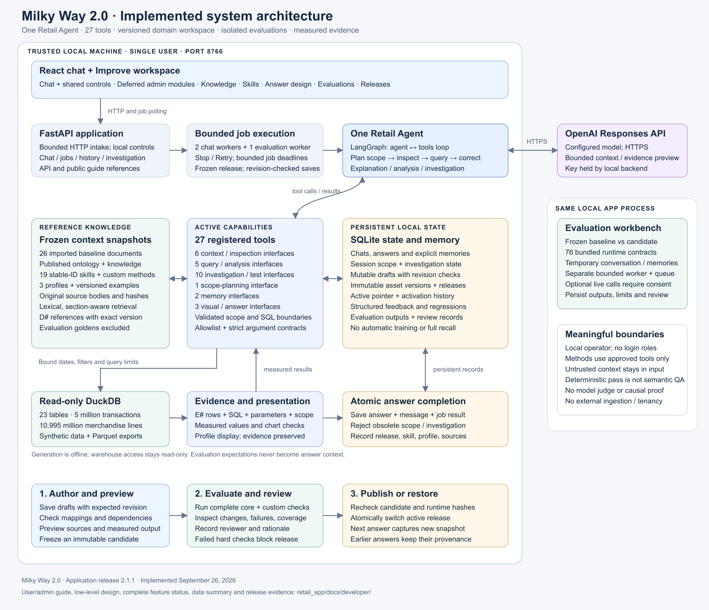

# Milky Way 2.0 — developer handbook

Documentation baseline: September 26, 2026. Application version: **2.1.1**. The source baseline, generated inventories and fresh verification are recorded in [Release and verification](RELEASE.md). This handbook describes the nested `Milky Way 2.0/` application. Paths in prose are relative to that directory unless stated otherwise.

For a single navigable reading copy, open [the offline HTML handbook](HANDBOOK.html). It contains all fifteen chapters, the shareable overview image and printable text. Additional Mermaid diagrams remain editable source in Markdown and are shown as expandable source in the HTML copy.

## What this product is

Milky Way 2.0 is a local conversational analyst for the fictional Summit Field retail business. A user can ask what a field means, request a measured analysis, run a retail playbook, or investigate a change with editable hypotheses. The system combines a reasoning model with retail definitions, bounded database tools, evidence checks, visual answer contracts and persistent conversation state.

The active runtime has **one Retail Agent** in a LangGraph agent/tool loop. Hypothesis generation, exploratory analysis, statistics and root-cause investigation are capabilities of that agent. Specialist names are absent from the active model tool registry; unregistered calls are rejected before dispatch. The status endpoint advertises no specialists. Do not interpret the legacy names as a deployed multi-agent topology.

The supported installation is one trusted user on one machine. The browser talks to FastAPI at `127.0.0.1:8766`; the backend makes model requests and reads the warehouse. The original Retail Data Agent is a separate sibling application at port 8765. The two copies share their history of development, not live application state.

## Start here

| Reader's question | Document |
|---|---|
| What runs, and how does everything connect? | [Architecture and diagrams](ARCHITECTURE.md) |
| What happens inside a request? What are the contracts and failure paths? | [Low-level design](LOW_LEVEL_DESIGN.md) |
| Which API routes and model tools exist, with what inputs? | [API and tool reference](API_AND_TOOLS.md), [OpenAPI snapshot](reference/openapi.json), [tool schemas](reference/tools.json) |
| What is implemented, partially implemented or absent? | [Feature and solution map](FEATURES.md) |
| What is in the synthetic warehouse, and what can it establish? | [Synthetic data](SYNTHETIC_DATA.md) |
| Where do I add ontology, skills, examples and evaluations today? | [Extension guide](EXTENDING.md) |
| What should a good answer look like? | [Answer examples and review rubric](ANSWER_EXAMPLES.md) |
| What tests exist and what has actually passed? | [Testing guide](TESTING.md), [complete test inventory](reference/TEST_INVENTORY.md), [release record](RELEASE.md) |
| How does the implementation apply OpenAI guidance? What is ready for local use? | [Local production readiness](PRODUCTION_READINESS.md) |
| How do I verify changes and keep the repository clean? | [Repository maintenance](REPOSITORY_MAINTENANCE.md) |
| How do I install, operate, back up and release this version? | [Release and operations](RELEASE.md) |
| How do users and admins improve the agent through the UI? | [User/admin guide](USER_ADMIN_GUIDE.md), [implemented plan](UI_IMPROVEMENT_PLAN.md) |
| How do registry, evaluation jobs and promotion work? | [Improvement workspace technical design](IMPROVEMENT_WORKSPACE_DESIGN.md) |

[Open the standalone architecture diagram](diagrams/system-architecture.svg). Editable Mermaid diagrams are in [the diagram directory](diagrams/system-architecture.mmd) and the architecture/design pages. The SVG is the shareable overview; the text documents explain the details that do not fit in one picture.

## What has been delivered

Release **2.1.1** hardens model/tool and HTTP boundaries, separates the heavy administration UI into deferred browser modules, and adds safe repository maintenance. See [local readiness](PRODUCTION_READINESS.md) and [release verification](RELEASE.md).

Release 2.1.0 added the complete local improvement workflow: ontology/knowledge and skill authoring, answer profiles/examples, deterministic and opt-in live evaluation comparison, structured feedback, reviewed publication/rollback, editable scope and answer-version provenance. See the [user/admin guide](USER_ADMIN_GUIDE.md) for interaction steps and the [release record](RELEASE.md) for test evidence and remaining limits.

- A React chat interface with saved chats, date controls, effective session scope, progress, Stop/Retry, evidence inspection, exports, feedback and an editable investigation panel.
- FastAPI routes for chat/jobs, history, context, catalog, profiles, playbooks, memory, feedback and investigation changes.
- A single reasoning loop with source retrieval, measured query tools, correction after tool errors, structured presentation and bounded execution.
- Nineteen executable baseline playbooks, nineteen primary visual families and eighteen hypothesis templates. Validated filtered adapters cover five playbooks; remaining filtered requests require a deliberate adaptation or a limitation.
- Read-only DuckDB access, parameterized scope queries, selected SQL validation, explicit evidence provenance and deterministic measured-value substitution.
- SQLite conversations, saved answers, explicit preferences, session scope/summary, versioned hypotheses and immutable historical tests.
- A deterministic synthetic warehouse with 23 tables, 5 million transaction headers, 10,995,475 sales lines, 790,834 return lines and 16,814,400 weekly inventory rows.
- Backend, frontend, data-contract and evaluation infrastructure. Passing these checks demonstrates their stated scenarios, not universal model accuracy.

## What “context”, “memory”, “skill” and “evidence” mean here

**Context** is material available to the model for understanding the question: metric definitions, schema, playbooks, code references, session scope and recent conversation. The document search is a local lexical index with section boundaries and source locations; no vector database is present.

**Memory** includes several different stores. Recent text is bounded. Session scope and a concise summary persist independently. Explicitly remembered conventions are stored in a separate SQLite table. Investigation history preserves tested claims and revisions. None of these is automatic model training.

**A skill** in this application is currently a retail method spread across source documents, a recipe or tool implementation, routing guidance, visual contracts and tests. Placing a new `SKILL.md` somewhere on disk does not register a new application capability. The host Codex skill system and this application's runtime are separate systems.

**Evidence** is a measured result with its query, parameters and scope, or a derived calculation with source references. `E#` identifies measured results within an answer. `D#` identifies retrieved document excerpts. A valid ID proves that the reference exists; it does not establish that a sentence is semantically supported.

## Reading the implementation

Start with `backend/main.py` for the request lifecycle, `backend/agent.py` for the graph and tool dispatch, and `backend/conversation.py` for durable scope and investigation orchestration. Then read `scope.py`, `investigations.py`, `evidence.py` and `presentation.py`. `frontend/chat.jsx` is the production browser entry point. `frontend/analysis-workspace.jsx` supplies the deferred data workspace (`app.jsx` preserves compatibility exports); browser entry, shared UI and deferred modules are documented in the architecture. HTTP policy is isolated in `http_boundary.py`; handbook references are served by `guide_api.py`.

The older [architecture reference](../architecture-reference.txt) is a proposal and source of terminology. The [existing implementation record](../IMPLEMENTATION.md), [original test report](../TEST_REPORT.md) and [dependency review](../DEPENDENCY_REVIEW.md) preserve historical work. Current source and fresh dated receipts take precedence when those documents differ.

## Documentation conventions

- **Implemented:** reachable code exists in the active application. The feature table separately states the test evidence and its limits.
- **Partial:** a useful subset is implemented, with the missing behavior stated explicitly.
- **Missing:** no active implementation was found for the capability.
- **Proposed:** a design or example for future work, including the UI improvement plan. It is not loaded by the current runtime.
- **Historical verification:** a saved earlier result, not a fresh check in this documentation pass.
- **Fresh verification:** a check run for this documentation baseline, with date and outcome in the release record.

The handbook excludes credentials, private conversation databases, local model transcripts and installed dependencies. The project `sources/` directory remains read-only reference material. Generated reference snapshots contain public application contracts, not private state.
