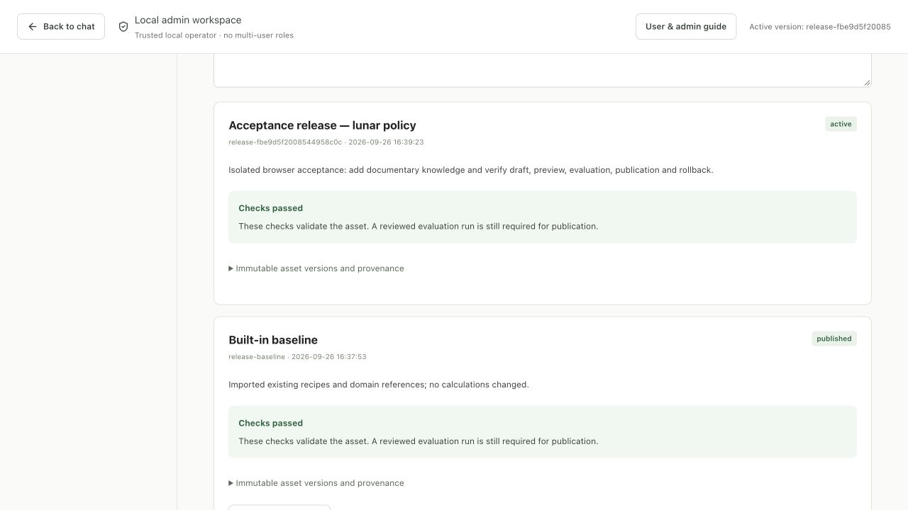

# Developer release and operations record

[Handbook](README.md) · [Testing commands](TESTING.md) · [Known gaps](FEATURES.md)

## Release 2.1.1 — local hardening and codebase maintenance

Delivered September 26, 2026 (local time) for the confirmed **trusted local developer/admin installation**. The product remains Milky Way 2.0. This patch preserves the warehouse, live conversations, workspace releases and saved configuration. Application source and all deliverables remain under the nested Milky Way 2.0 folder. Source hashes in [the current manifest](reference/source-manifest.json) identify the working-tree delivery.

### Changes

- Strict provider schemas and local argument validation for all 27 tools. Unknown tool names, unexpected fields, wrong types, invalid/duplicate/nonfinite JSON and oversized arguments fail before dispatch. Nullable optional wire values preserve handler defaults.
- Static instruction policy separated from changing reference input. Editable documents, memory, skills, profiles and history are no longer placed in high-priority instructions. Removed dead recursive specialist dispatch and stale specialist assumptions in tests.
- HTTP policy extracted from request orchestration, with bounded streamed bodies and a ten-second upload deadline. Documentation downloads have an explicit private-file boundary. Repeated guide clicks reuse a metadata-keyed reference inventory.
- The administration UI is split into small modules and deferred until opened. Shared evidence/visual renderers remove the report/workspace import cycle. A build manifest checks chunk dependencies and an entry budget; hashed chunks are published before the stable entry and retained for open tabs.
- The maintenance utility now provides one offline check workflow and preview-first cleanup of exact regenerable files. Ignore rules cover development caches. Developer/admin guidance, architecture diagrams and source references are refreshed.

### Current verification

The [hardening receipt](reference/hardening-verification.json) records the final results. This patch's full backend suite passed **317 tests** in **32.444 seconds**, including 30 added checks across tool boundaries, HTTP/guide privacy and cleanup safety. Existing deterministic baseline/candidate checks still exercise all 76 core cases. Model calls were mocked and test state isolated.

| Check | 2.1.1 result |
|---|---|
| Frontend | Six suites and production build passed; complete emitted chunk graph and content hashes verified |
| Initial JavaScript | 952,179 → 886,996 bytes: **65,183 fewer bytes (6.85%)**; all screens together remain 953,184 bytes |
| Browser smoke | Saved chat/evidence, all five admin sections, deferred analysis charts, reload and 15-chapter handbook passed; no console errors |
| Service | Version 2.1.1 ready on loopback; six current JavaScript assets returned HTTP 200 with intended cache policy |
| User state | 22 conversations, 90 messages and 46 analyses preserved; SQLite integrity check passed; no jobs were running before restart |
| Cleanup | Obsolete browser QA database and regenerable caches/test artifacts removed; exact counts in the maintenance audit and hardening receipt |
| Documentation | Public links, contract JSON, diagram syntax and delivered source hashes checked |

The receipt records the observed environment and limits. The earlier 2.1.0 acceptance receipts and screenshots are retained with their original scope; they are not relabeled as new tests.

A fresh SQLite backup was created with the backup API and passed integrity verification before the local service update. Cleanup never targets normal state or backups. No paid live-model benchmark, Docker execution, broad load test or fresh security-advisory audit was performed. [Local readiness and OpenAI guidance](PRODUCTION_READINESS.md) explains the controls and their limits; [maintenance](REPOSITORY_MAINTENANCE.md) explains the repository boundaries and commands.

---

## Release 2.1.0 — historical improvement workspace record and supported scope

Historical release: **Milky Way 2.0**, application version **2.1.0** — the improvement workspace release. Delivered on **September 26, 2026**, as working-tree changes over source commit `d21f593`. [source-manifest.json](reference/source-manifest.json) records the actual delivered file hashes; the baseline commit alone does not contain this implementation. All source, built frontend, tests, references, diagrams and guides are in the nested Milky Way 2.0 folder.

The supported target remains a trusted local user, loopback browser connection and one Uvicorn process. The installed macOS service uses the login user's LaunchAgent. Operator/reviewer labels provide local audit context; authentication, independent approval roles and tenancy are not part of this release. Docker configuration remains provided but container execution was not freshly verified.

## Implemented features

- Five **Improve workspace** sections: Knowledge & ontology, Skills, Answer design & examples, Evaluations, and Feedback & releases.
- Versioned knowledge/concepts/methods/profiles/examples/suites: optimistic drafts, 53 initial built-in assets, immutable versions/releases and atomic active pointer with restoration history. All built-ins are read-only; duplicate to customize.
- Alias, physical field/measure, unit/basis, relationship, dependency and tool/handler validation. Invalid draft previews report errors without changing active retrieval.
- Frozen original source text/chunks with version hashes; new answers capture a release once. Candidate preview and evaluation do not hot-swap the active context.
- Stable explicit mappings for all nineteen built-in skills and visual contracts; existing numerical recipes remain code-owned.
- Quick answer, Business review and Analyst detail profiles; real measured answer previews; good/bad examples. Profiles preserve scope, evidence, units and material limitations.
- A separate bounded evaluation worker, 76 bundled runtime contracts, custom case editing, immutable baseline/candidate comparison, cancellation, restart recovery, explicit opt-in live budgets and review.
- Promotion gates require complete foundation checks, exact candidate/runtime/data provenance, no hard failures, approved applicability review and current live-run review where present. Citation/currency errors remain hard failures after answer sanitization. Older failing live runs cannot disappear from gate decisions because of UI pagination. A review change between gate inspection and activation is detected.
- Structured answer feedback captures the original answer/evidence/versions. Reviewed issues can become unpublished regression drafts requiring explicit expected checks.
- Chat profile selector, **Why this answer?**, scope chips/editor, conflict handling and cancellation of superseded answers. Scope edits validate the next chat's date contract. Synchronous local suggestions preserve saved session display.
- Thirteen handbook chapters, an updated architecture image/editable diagrams, generated API/tool/schema inventories, developer extension instructions, user/admin workflows and release receipts.

## Verification for this implementation

The final machine-readable receipt is [implementation-verification.json](reference/implementation-verification.json). The backend run summary is [backend-test-results.json](reference/backend-test-results.json); the generated test inventory identifies individual tests. These are local deterministic/component/UI checks, not an enterprise live-quality benchmark.

| Check | Result / evidence | Scope |
|---|---|---|
| Backend offline regression | **287 passed, zero failed, zero skipped**; 31.568 seconds | Full warehouse, temporary state, mocked model calls; includes original 232 regressions plus new registry/evaluation/integration coverage |
| Enterprise foundation | **76 baseline + 76 candidate checks passed** | Real runtime contracts in isolated tests and browser workflow; no model calls |
| Frontend verification | **Five suites**, including the new admin/workspace suite | Forms, immutable built-ins, errors, profiles/evidence, scope/provenance and regression contracts |
| Production bundle | Built `static/app.js` included | New source/styles served by the existing local app |
| Browser authoring and preview | Passed | Create/save/validate knowledge and confirm candidate retrieval |
| Browser publication and restoration | Passed | Full comparison, explicitly labeled automated acceptance review, publish candidate, restore baseline |
| Negative promotion check | Passed | Changing source after a run blocked publication until rerun |
| Browser output preview | Passed | Measured profile fixture rendered with narrow-screen preview |
| Browser scope and responsive interaction | Passed with fixes recorded below | Native keyboard date entry, filter/return-basis editing, responsive layout |
| Structured feedback | Browser and backend coverage | Saved correction, reviewed triage and regression draft creation |
| Documentation/reference checks | Final receipt | Local links, hashes, JSON/SVG and rendered overview/handbook |
| Warehouse validation | Existing same-day receipt: **105 checks passed** | Data/schema were not modified by this implementation; [data validation](reference/full-data-validation.json) |

### Issues found during acceptance and corrected

1. Scope editor accepted comparison durations that the next top-level chat would reject. The form and API now validate the compatible date contract before saving.
2. The offline reply response could lack embedded session state, temporarily hiding valid scope chips. The client now hydrates the saved conversation/session.
3. Evaluation reference checking could overlook an invalid citation once the answer sanitizer changed its textual form. Explicit evidence-check flags plus legacy warning/marker checks preserve that failure.
4. A live failure older than the recent-history page could be omitted from promotion checks. The gate now queries candidate history independently of display pagination.
5. Built-in mutation rules differed between UI and API. All built-ins now require duplication through both surfaces.
6. Malformed saved draft fields could fail during preview before validation was shown. Invalid assets are excluded from retrieval and field errors are returned.

### Browser evidence

Acceptance used an isolated SQLite directory with model calls disabled. Test drafts, feedback and releases were kept out of the normal user workspace. The reviewer label and notes explicitly described automated interface acceptance, not human validation of enterprise meaning.



[Measured profile preview](reference/improve-profile-preview.png) · [Narrow-screen UI](reference/improve-mobile.png) · [Feedback regression workflow](reference/improve-feedback-regression.png) · [Full browser acceptance record](reference/BROWSER_ACCEPTANCE.md)

## Migration and local deployment

Before service changes, the existing database was copied with the SQLite backup API and passed integrity verification. The backup is retained under `retail_app/state/backups/`. Its private contents are excluded from source control. The workspace migration adds tables and imports built-in assets; it does not rewrite existing chats, numerical recipes or warehouse data. Legacy needs-review feedback is imported with its original saved evidence.

The final deployment receipt records service readiness, application version and preservation of the prior chat/message/answer counts. Runtime migration seeds **26 references, four concepts, nineteen skills, three profiles and one evaluation suite**. Existing registry versions stay immutable on restart; new business edits should use the UI draft/publish flow. Future built-in/schema upgrades need an explicit migration rather than a silent seed overwrite.

For a content regression, restore a previously published release. For an application/schema regression, stop the service and follow a tested database/code restore procedure; content rollback is not a schema downgrade. Backups include workspace assets, releases, feedback and evaluation records as well as chats.

## Remaining limitations and release qualifications

No billable live evaluation or fresh model-quality benchmark was performed for this implementation. Provider paths are tested with mocked calls, including isolation and budgets. The initial 76 cases are developer-authored runtime checks; they are not a reviewed business truth set. Use candidate-specific checks and human-reviewed live examples before drawing conclusions about answer quality. The workbench exposes coverage gaps and semantic review status without inventing a quality score.

External identity/roles, multi-tenant permissions, connectors/uploads, calibrated automated semantic judges, generalized formula compilation, distributed execution and public hosting remain outside the approved local release. Missing business data and the remaining fourteen filtered-playbook adapters remain substantive analytical gaps. No fresh Docker, advisory scan, large-load benchmark or enterprise security certification is claimed.

Historical live scenarios remain in [MILKY_WAY_2_VERIFICATION.md](../MILKY_WAY_2_VERIFICATION.md), with their original date and scope. Earlier browser-policy limitations apply to that earlier record; this release has the fresh interface checks above. The warehouse/data kit retains its existing reproducibility and Parquet evidence.

## Runtime and build environment

Observed in this verification environment:

| Component | Version |
|---|---|
| Python application runtime | 3.12.14 |
| FastAPI | 0.141.1 |
| Uvicorn | 0.54.0 |
| DuckDB application reader | 1.5.5 |
| LangGraph | 1.2.12 |
| HTTPX | 0.28.1 |
| Pydantic | 2.13.5 |
| SciPy | 1.18.1 |
| Node used for frontend tests/build | 24.19.0 |

The application [Python lockfile](../../requirements.lock.txt) and [frontend lockfile](../../pnpm-lock.yaml) define the app dependencies. The data generator's own [lockfile](../../../retail_data/requirements.lock.txt) pins DuckDB 1.4.3 for deterministic generation. This is intentionally distinct from the newer application reader. Use the data kit's pinned environment when reproducing table contents; a successful newer reader is not a same-seed generator-equivalence claim.

## Clean-machine installation

From the Milky Way 2.0 root:

```sh
python3.12 -m venv .venv-runtime
.venv-runtime/bin/python -m pip install -r retail_app/requirements.lock.txt
cp retail_app/.env.example retail_app/.env
```

Set `OPENAI_API_KEY` and `OPENAI_MODEL` locally in the ignored file or process environment. Do not put credentials into documentation, source control or browser configuration. The loader supports `OPENAI_API_KEY`, `OPENAI_MODEL`, `RETAIL_DB` and `RETAIL_STATE_DIR`; existing process environment values take precedence over `.env` values.

The source clone needs a generated warehouse at `retail_data/data/full/retail.duckdb` and its `manifest.json`, or a correctly packaged alternative. `RETAIL_DB` changes the database path, but `/api/status` also expects a manifest beside that database and the app's metadata/recipes still describe Summit Field. It is not an arbitrary warehouse connector. See the data kit for generation or transfer of the full data package.

The prebuilt frontend is included. To modify it, install Node and the locked frontend dependencies, then test/build from `retail_app`. The included local Python environment depends on this Mac's runtime paths; do not treat copying `.venv-runtime` to another computer as a portable installation method.

## Start, stop and health

```sh
./retail_app/start.sh
```

The startup script selects `RETAIL_PYTHON` if supplied, otherwise `.venv-runtime/bin/python` then `.venv/bin/python`. It requires Python 3.12 or later. Uvicorn binds `127.0.0.1:8766`, uses one worker, limits server concurrency to 32 and disables access logging/server headers. These HTTP concurrency settings are separate from the two admitted analysis jobs.

`GET /health/live` confirms the process responds. `GET /health/ready` checks warehouse and SQLite connectivity and returns whether the model is configured. `agent_ready` only checks configuration presence; it does not prove the key/model can make a successful provider request. `/api/status` describes dataset and app capabilities; `/api/quality` reads saved receipts and is not a fresh test runner or complete live-verification ledger.

For the optional macOS login service:

```sh
.venv-runtime/bin/python retail_app/service.py install
.venv-runtime/bin/python retail_app/service.py status
.venv-runtime/bin/python retail_app/service.py restart
.venv-runtime/bin/python retail_app/service.py stop
```

Run only the action intended; the sequence above documents available commands. The label is `com.milkyway.retailagent.v2`. The plist is in the user's `Library/LaunchAgents`, and service logs are in `retail_app/state`. Restart after configuration or indexed context changes. Stop the foreground server with Control-C when it is not managed by the service. The service operates while the Mac is awake and the user is logged in.

## Packaging and data identity

[DELIVERY_MANIFEST.json](../../../DELIVERY_MANIFEST.json) records the packaged warehouse path, size and SHA-256. The baseline warehouse hash is `2fcc7d5d7f3f18b257a7b7279604bcd807d0c50997010e9ae05c70fb7b034ede`. A fresh matching identity check is recorded in the documentation verification receipt.

Included in source control: application source, prebuilt frontend, dependency locks, schemas/generator, reference documents and tests. Excluded: credentials, generated warehouse/Parquet, installed dependencies/runtime, private conversation state, logs and live receipts. A deployable local delivery therefore needs both source and the appropriate data/runtime setup; a Git clone alone is not the complete installed application.

Docker Compose mounts the full warehouse read-only and SQLite state as a named volume. It publishes the app to host loopback port 8766, uses a read-only container filesystem plus temporary storage, drops capabilities and configures resource/log limits. The Dockerfile uses a non-root application user and readiness health check. Test actual build, environment handling, writable state permissions and restart persistence before claiming container support on a new host.

## Backup and restore

The implemented backup utility uses SQLite's consistent backup API, includes WAL-visible committed content, exclusively creates the output and runs `PRAGMA integrity_check`.

```sh
.venv-runtime/bin/python -m retail_app.maintenance backup
```

Use `--state-dir` for an alternate state root and `--output` for a new destination. The backup includes chats, analyses, preferences, jobs, feedback, sessions, investigations, workspace assets/releases and evaluation runs in the application database. It excludes the warehouse, credentials, source, logs and environment/model configuration.

**Proposed restore procedure, not a completed restore drill:** verify a backup with SQLite integrity checks; stop the service; preserve the entire existing state directory including any WAL/SHM files; create a separate restore directory containing the backup as `app.sqlite3`; launch a test instance against that directory using `RETAIL_STATE_DIR`; verify conversations, evidence, preferences and investigation history; only then choose whether to use the restored directory for normal operation. Never copy only a live database file over an active WAL database. Preserve the previous directory until restore acceptance is complete.

There is no restore command, scheduled backup policy, retention/encryption policy or automated restore drill today. These gaps remain operational work.

## Upgrade, migration and rollback

Legacy tables use idempotent DDL; the new workspace tables are tracked by `workspace_migrations`. The first migration is additive and preserves existing records. Before a code update, record the source/data identity, back up state, retain the known-good app build and capture configuration separately. Validate the update against a copied state/database in an isolated instance. Do not assume downgrading application code can read state after an unknown newer schema change.

For a content change, use the implemented Restore action on a previously published release. For a code/schema rollback, retain the current state directory and use a verified pre-upgrade backup in a separate directory with the matching prior application version; test it before normal operation. This avoids modifying immutable registry history or attempting an unsupported schema downgrade. A successful pre-upgrade backup and record-preservation check are recorded for this release; an automated database restore command/drill remains separate work.

## Operational troubleshooting

| Symptom | First checks / expected recovery |
|---|---|
| Port 8766 unavailable | Check foreground process/LaunchAgent status and log categories; verify no duplicate server uses the port |
| Local playbooks work, chat does not | Check configured model/key presence and actual provider access; configuration presence alone is not a successful request |
| Warehouse unavailable | Check `RETAIL_DB`, file access and adjacent manifest; do not substitute a mismatched database silently |
| Two analyses running | Wait or stop an active job; adding Uvicorn workers does not safely extend this design |
| Chat stuck after storage fault | Polling can reconcile a known in-memory terminal state; restart marks unfinished jobs interrupted |
| Query timeout/huge answer | Narrow scope/aggregation; do not increase all limits without memory and latency measurements |
| New definition not retrieved | Check draft save, candidate preview, selected versions and publication; registry edits do not require a restart |
| Old report lacks new visuals | Rerun the analysis; saved history is not backfilled with invented measurements |
| Hypothesis result stale | Review the edit/scope and continue with a fresh criterion/test |
| Current quality page omits a live run | Check the receipt path expected by `/api/quality`; not every historical live/evaluation directory is aggregated there |

## Release acceptance limits

The current application is useful for local descriptive retail analysis. Public deployment requires identity/data authorization, tenant separation, TLS, managed secrets, monitored operations and validated capacity. Broader answer accuracy requires a reviewed evaluation program. Missing experimental, traffic, actual-delivery and lost-demand data still limits which business questions can be answered. These limits are visible in [Feature coverage](FEATURES.md) and [Synthetic data](SYNTHETIC_DATA.md), and should remain visible in future developer releases.
