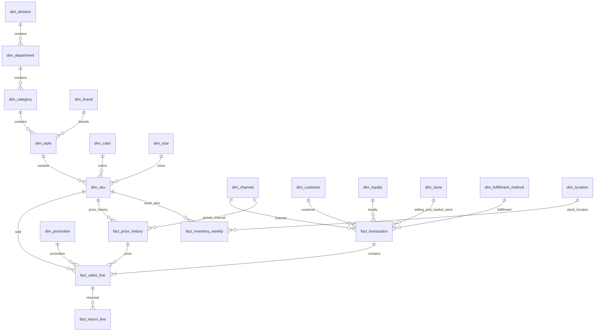
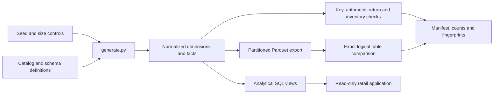

# Summit Field synthetic data

[Handbook](README.md) · [Metric contract](../../../retail_data/docs/METRICS.md) · [Full data dictionary](../../../retail_data/docs/DATA_DICTIONARY.md) · [Model/business rules](../../../retail_data/docs/MODEL.md)

## Identity, scale and provenance

Summit Field is a fictional omnichannel sporting-goods/apparel retailer. Customer records, names, products and transactions are generated. No actual retailer performance or customer information is represented. Public retail concepts informed the model; values and business rules are invented assumptions rather than industry benchmarks.

Sales cover **January 1, 2024–December 31, 2025**. The linked-return observation window ends **March 1, 2026**, giving every sale a full maximum 60-day return window. The calendar therefore has 791 dates. Monetary storage is integer US cents. The full warehouse is 1,088,172,032 bytes; the saved delivery report records approximately 392.5 MB of Parquet exports. Sizes are delivery observations, not capacity guarantees.

Default generation uses seed `20250925`, 5,000,000 transaction headers, 60 stores, 600,000 identified customers and DuckDB 1.4.3. The generator uses deterministic hashed streams with no generation-time network calls. Reproduction requires the same code, dimensions, seed and engine version. Equivalent logical tables do not imply byte-identical Parquet output across every platform/thread setting.

## Complete table inventory

Counts below are the recorded full-dataset counts from [DELIVERY_REPORT.md](../../../retail_data/docs/DELIVERY_REPORT.md), supported by the dataset manifest and validation artifacts. The fresh contract validation outcome for this documentation baseline is in [Release](RELEASE.md).

| Table | Rows | Grain / purpose |
|---|---:|---|
| `dim_date` | 791 | One calendar day, including retail/fiscal attributes and return tail |
| `dim_time` | 1,440 | One minute-of-day key |
| `dim_channel` | 4 | One sales channel |
| `dim_fulfillment_method` | 4 | One fulfillment method |
| `dim_store` | 61 | Sixty stores plus sentinel store zero for non-store selling |
| `dim_location` | 62 | Sixty store stock locations plus two distribution centers |
| `dim_division` | 7 | Six merchandise divisions plus sentinel division |
| `dim_department` | 12 | One merchandise department |
| `dim_category` | 24 | One category |
| `dim_brand` | 12 | One fictional brand, including a private label |
| `dim_color` | 4 | One color label |
| `dim_size` | 15 | One size label |
| `dim_style` | 120 | One style with category/brand attributes |
| `dim_sku` | 2,400 | One sellable style/color/size variant |
| `dim_customer` | 600,001 | Identified customer plus anonymous key zero |
| `dim_loyalty` | 480,001 | Loyalty account plus no-loyalty key zero |
| `dim_promotion` | 145 | 144 division/month campaigns plus no-promotion sentinel |
| `dim_return_reason` | 4 | One return reason |
| `fact_price_history` | 57,600 | SKU × channel × quarter price interval |
| `fact_transaction` | 5,000,000 | One completed transaction header |
| `fact_sales_line` | 10,995,475 | One merchandise line within a completed transaction |
| `fact_return_line` | 790,834 | One generated return record linked to an original sale line |
| `fact_inventory_weekly` | 16,814,400 | Location × SKU × inventory week, including zero-sale weeks |

The complete field types, primary keys and foreign keys live in [catalog.json](../../../retail_data/docs/catalog.json) and [schema.sql](../../../retail_data/sql/schema.sql). The generated warehouse omits physical constraints for loading speed; the validator enforces the logical key/relationship contract. The published DDL contains constraints for constructing a constrained copy.

## Relationship diagram

This is a conceptual relationship view. Date/time and return-location/reason links are omitted from the picture for legibility; the catalog and DDL specify every actual key. Always join channel through the transaction header. Use original sales-line keys to aggregate linked returns before joining back to sales.

## Analytical views and metric basis

| View | Role | Important behavior |
|---|---|---|
| `v_product` | Flatten product hierarchy | One row per SKU with category/department/division/brand/color/size context |
| `v_sales` | Sales-line analytical relation | Enriches lines with transaction, time and product context; before returns |
| `v_sales_after_returns` | Original-sale cohort after observed linked returns | Aggregates returns to the original line to avoid duplicating sale amounts |
| `v_merchandise_activity` | Calendar merchandise events | Sales and refund activity on their event dates; not the same as cohort realization |

| Metric | Definition / grain | Common mistake |
|---|---|---|
| Sales before returns | Completed merchandise revenue after markdown/promotion discounts | Calling it profit, total paid or sales after refunds |
| Gross sales | Regular merchandise price × quantity | Treating it as realized revenue |
| Sales-cohort realized revenue | Original sales minus linked merchandise refunds through the frozen extract | Treating it as return-date cash/activity |
| Merchandise margin | Revenue less merchandise cost, with returned revenue/recovered cost on the chosen basis | Claiming full channel or operating profitability |
| Orders | Distinct completed transactions within the selected slice | Summing distinct grouped orders across overlapping divisions |
| Identified buyers | Distinct customer keys greater than zero | Counting anonymous key zero as one real customer |
| Slice AOV | Selected merchandise sales / matching distinct orders | Claiming whole-basket AOV after filtering product lines |
| Return unit rate | Linked returned quantity / original cohort units with observation maturity | Dividing unrelated return-date events by current-period units |
| Inventory on hand | Balance at one completed snapshot | Adding balances across weeks as though they were sales flows |
| Promotion/loyalty comparison | Descriptive associated sales or group differences | Calling it incremental causal impact |

## Time, identity and generation rules

The model simulates completed transactions with one to five lines, unit quantities and linked price/promotion rules. It includes tax and shipping columns but merchandise analysis excludes them unless explicitly requested. Tax is a simplified flat 7%, not jurisdictional tax logic. Digital transactions use selling-store key zero and a separate market-store attribution; these must not be conflated in regional reporting.

Customer key zero is anonymous. Loyalty key zero means no loyalty attached. Sentinel dimension rows preserve referential integrity but are not additional real stores, customers or merchandise divisions. Customer/store attributes are not a full slowly changing history.

Weekly inventory tracks opening, receipts, restocked returns, sold units, shrink, closing, reserved, available and in-transit balances. The construction replenishes inventory to satisfy observed demand. The balance equation is:

`opening + receipts + restocked returns − sold − shrink = closing`

Available stock is closing minus reserved. Inventory week buckets and retail reporting week conventions are documented separately; developers must use the recipe's date logic instead of assuming every week field has identical boundaries.

Generation assumptions such as a built-in price movement are known construction rules. They do not create an empirical elasticity experiment. A labeled enterprise incident/scenario system would additionally need controlled scope, dates, manipulated factors, expected accounting effects, observation noise and independent truth labels.

## Data pipeline and reproducibility

See [generator](../../../retail_data/src/generate.py), [validator](../../../retail_data/src/validate.py), [Parquet verifier](../../../retail_data/src/verify_parquet.py) and [integration tests](../../../retail_data/tests/test_integration.py). The generator refuses to overwrite a nonempty output directory. Use a separate sample path for development; do not regenerate over the application warehouse.

Historical evidence records 105 full-data validation checks, 68 sample/replica integration checks, all 23 Parquet table comparisons and five data API checks. These are different test scopes. Application tests, model evaluations, container tests and browser acceptance answer different questions and must be reported separately.

## What is absent and what that prevents

| Absent data/design | Unsupported conclusion |
|---|---|
| Experiment/holdout or credible quasi-experimental identification | Incremental promotion/loyalty lift and causal price elasticity |
| Sessions, views, carts, checkouts and attribution | Conversion/abandonment and web-funnel causality |
| Daily/intraday availability and unmet demand | Stockout duration and lost sales |
| Actual ship/delivery events and carrier/service promises | On-time delivery reliability |
| Fulfillment, shipping labor and operating costs | Full order/channel profitability |
| Competitor/market universe | Market share, ACV and competitive distribution |
| Genuine launch/delist/assortment histories | Validated new-product or delisting decisions |
| Targets, plans, forecasts and accountability hierarchy | Budget attainment and management target variance |
| Store opening/closure/remodel history and approved comp rule | Enterprise comparable-store reporting |

The correct response to these questions names the missing fields/design, states what the present data can measure, and keeps any descriptive substitute clearly labeled. Extending ontology or examples can improve that explanation; it cannot supply missing observations.
