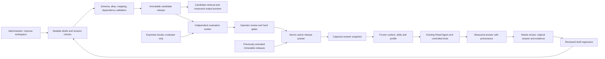

# Improvement workspace: approved plan and implementation status

**Status: implemented for the local Milky Way 2.0 application.** The user approved this plan and the code now lives inside the `Milky Way 2.0` folder. This page records what shipped against the approved scope. Read [User and administrator guide](USER_ADMIN_GUIDE.md) for the interaction steps, [Extension guide](EXTENDING.md) for supported content schemas, [Implementation design](IMPROVEMENT_WORKSPACE_DESIGN.md) for service contracts, and [Release guide](RELEASE.md) for verification results and operating limits.

## Outcome and navigation

The chat sidebar now opens **Improve workspace**, with Knowledge & ontology, Skills, Answer design & examples, Evaluations, and Feedback & releases. Administrators can author a draft, preview it without changing production chat, compare immutable baseline/candidate versions, review checks, publish, and roll back. Chat exposes output profile selection, scope editing and **Why this answer?** provenance.

The meaning of “enterprise valuations” in the approved plan is enterprise evaluations: reliability, scope, references, numerical consistency, response contracts and reviewed answer quality. Financial valuation is not implemented by this workspace; it would require a separately specified method and data.

## Delivery against the six phases

| Phase | Implemented behavior | Source | Practical boundary |
|---|---|---|---|
| 1. Versioned foundation | Idempotent SQLite migration; stable IDs; mutable drafts with expected revision; immutable versions and release maps; atomic publication/rollback; historical provenance | `workspace_assets.py`, `workspace_api.py` | Local operator labels do not establish enterprise identity or independent approval |
| 2. Knowledge & ontology | Text/concept/metric/entity/relationship authoring; aliases; approved measure/field mapping; basis/unit checks; conflict and dependency errors; candidate retrieval preview | `workspace_assets.py`, `improve-workspace.jsx` | A document cannot create a field or formula; unsupported execution remains blocked |
| 3. Skills and answer design | Nineteen stable built-in skill manifests; duplication/new method authoring; tool/handler/filter/dependency validation; profiles and good/bad examples; measured output preview | `workspace_assets.py`, `presentation.py`, `improve-workspace.jsx` | Custom executable code and new chart renderers require developer changes |
| 4. Evaluation workbench | 76 core deterministic contracts; editable suites; baseline/candidate runs; exact snapshot and fingerprint receipts; cancellation; capped independent worker; optional bounded live runs; operator review and hard release gates | `workspace_evaluations.py`, `evaluation_api.py`, `enterprise_evaluations.json` | Core tests do not certify prose quality; no automated semantic-judge service is claimed |
| 5. Feedback and regression | Structured answer feedback with original evidence and versions; revision-controlled triage; reviewed conversion to a draft case; explicit expected checks required | `workspace_assets.py`, `workspace_api.py`, `improve-workspace.jsx` | A correction never silently becomes a verified expected answer or published change |
| 6. Chat integration | Release captured at admission; frozen source search throughout the turn; profile preferences; evidence/provenance drawer; scope updates through validated lifecycle APIs | `workspace_runtime.py`, `agent.py`, `main.py`, frontend answer/chat components | Earlier answers retain the release/source versions recorded at generation |

## The administrator interaction

1. **Author.** Select a section and create a draft, or duplicate a built-in. Built-in source documents stay immutable. Use plain business definitions, approved metric names and existing permitted capabilities.
2. **Validate.** Save and review field errors. Drafts with missing data support can be retained, but incompatible mappings, aliases, dependencies and unsupported handlers cannot publish.
3. **Preview.** Retrieve the new term from the candidate, or preview a profile against measured monthly/channel sales for January–March 2025. Confirm the meaning, sources, units and visible answer shape.
4. **Freeze a candidate.** Open Feedback & releases and create a release. The candidate contains a complete immutable version set; later draft edits require another candidate.
5. **Evaluate.** Select the baseline and candidate. Run the complete bundled deterministic suite. Add domain-specific checks for changed assets and inspect the coverage panel. Optional live cases require explicit model-call consent, budgets and human review.
6. **Review.** Enter the operator name, decision and notes. Hard failures cannot be overridden by approval. Review applicability and coverage gaps; a declared case-to-asset label is not proof of correctness.
7. **Publish.** Select the passing run for the exact candidate and publish against the current active release. Code/data changes after testing, a stale active pointer, unreviewed live results or a candidate built on an old parent require another run or candidate.
8. **Use and inspect.** Ask a new chat question, select the intended profile and inspect **Why this answer?**. Publication affects future answers; a running answer stays on its captured snapshot.
9. **Revert when needed.** Roll back to a previously activated release, recording a reason. Drafts and historical answers remain available. Code/database rollback follows the release operations guide.

## Architecture added by this release

The application retains one Retail Agent. The new worker executes evaluation cases; it is not another business reasoning agent. Existing DuckDB access remains read-only. Workspace content, versions, releases, feedback and evaluation receipts live in new SQLite tables alongside the existing chat/investigation data.

Full snapshots include evaluator suite definitions for reproducibility and remain on the server. `search_snapshot` excludes evaluation assets; model-facing skill and profile settings use explicit allowlists. The runtime never serializes the complete snapshot into the model prompt. Source citations point at immutable stored versions, including source hashes and original locations.

## Required checks and where to find evidence

| Area | Implemented check |
|---|---|
| Migration and persistence | Repeat initialization, existing-chat preservation and separate evaluation state |
| Concurrency | One winner for concurrent draft writes; structured stale revision and stale release errors |
| Immutable history | SQLite triggers prevent changing/deleting stored versions and release manifests |
| Publication | Validation, complete core suite, exact candidate, operator review, unchanged fingerprints and expected active pointer |
| Ontology | Alias collision, unsupported mapping, canonical units, required basis and missing relationship targets |
| Skills | Stable nineteen ID mappings, existing tool/handler allowlist and dependency/profile references |
| Retrieval and leakage | Original role/ranking behavior retained; frozen source reads; drafts isolated; evaluator expectations excluded |
| Feedback | Original versions and evidence retained; reviewed status required; conversion creates an unpublished draft with unverified expectations |
| Presentation | Profile settings applied to actual measured payload; mandatory safeguards retained |
| UI and integration | Browser walkthroughs, responsive/keyboard behavior, scope editing and end-to-end author/evaluate/publish/rollback receipts are recorded with the release |

See `tests/test_workspace_assets.py`, `tests/test_workspace_evaluations.py`, `tests/test_workspace_integration.py` and the frontend test scripts. [Testing](TESTING.md) and [Release](RELEASE.md) distinguish fresh receipts from prior documentation-era checks. A successful deterministic run is a runtime contract result; it must not be described as a measured pass rate for all enterprise questions.

## Remaining enterprise and quality work

The delivered local workflow is useful without an external identity service or remote connector. It does not add multi-user permissions, tenancy, SSO, independent approval enforcement, cloud deployment or arbitrary plugin execution. Those remain a later deployment decision.

Narrative/semantic quality requires representative reviewed live cases. Live runs are available and explicitly budgeted; this implementation does not replace human judgment with an unexplained model score. A production program should calibrate reviewers, expand real business scenarios, assign metric owners, and define latency/quality targets from observed runs.

The ontology registry stores structured concepts and approved mappings; it is not a universal semantic compiler. New data, metrics, inventory/return event grains and business operations need reviewed adapters and independent reconciliation tests. Hypothesis templates remain part of the packaged context library and investigation mechanisms rather than a separately editable hypothesis-template asset kind.

This page supersedes the earlier “plan only — awaiting approval” version. The approved author → preview → test → review → publish workflow is now implemented; the limitations above identify the remaining scope without presenting proposed enterprise features as shipped.
