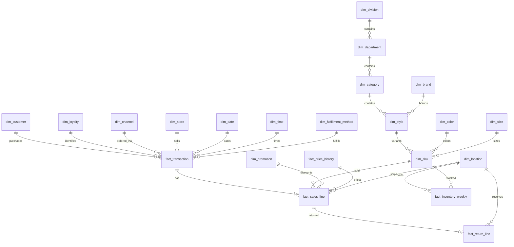

# Model, business rules and analytical boundaries

## Business identity and coverage

**Summit Field** is a fictional US omnichannel retailer. Sales span 2024–2025 and the extract is frozen after returns on March 1, 2026. It is one business entity, one currency, and a simplified flat tax environment. No real store map, supplier, loyalty program, or merchandise catalog is reproduced.

The six merchandise divisions are Apparel, Footwear, Team Sports, Outdoor, Golf, and Fitness. Each division has two departments; each department two categories; each category five styles; each style four colors and five sizes/configurations. This deliberately regular assortment makes the first agent easy to build. Equipment configurations A–E are abstract variants, not realistic dimensions or technical product specifications. All stock-holding locations carry all SKUs throughout the modeled period.

## Relationship map

The schema is a constellation of sales, returns, prices and inventory facts with shared dimensions. Some merchandise dimensions are normalized into a short hierarchy. The flattened `v_product` view supplies a conventional product dimension for simpler agent queries. Every field and foreign key is documented in generated metadata.

## Fact grains

| Table | One row is | Important keys and measures |
|---|---|---|
| `fact_transaction` | One completed receipt/order | Customer, loyalty, order channel, selling store, market store, fulfillment method, local minute, line/unit counts, summed amounts |
| `fact_sales_line` | One position on a receipt/order | SKU, effective price, promotion, physical fulfillment location, quantity, original and discounted amounts, cost, delivery promise |
| `fact_return_line` | One returned unit against one original line | Original sale, receipt, SKU, reason, receiving location, return date, refund and recovered cost |
| `fact_price_history` | One SKU/channel/quarter price interval | Inclusive dates, effective regular price and markdown percent |
| `fact_inventory_weekly` | One SKU/location/week | Opening, receipts, sales, restocks, shrink, closing, reserved, available and illustrative transit |

Dimensions are current/static, not slowly changing dimension type 2. Quarterly price history is explicit because price at sale must be reproducible. IDs are stable for the same configuration and seed. Sales-line keys intentionally leave gaps to avoid renumbering records when basket lengths differ. Unique line positions are `(transaction_key, line_number)`.

## Synthetic generation assumptions

| Behavior | Implemented rule |
|---|---|
| Date sampling | Daily weight 100; November 150; December 180; August 130; add 35 on weekends |
| Basket lines | 1/2/3/4/5 with probabilities 35%/30%/20%/10%/5% (expected 2.2 lines) |
| Units per line | One unit 91%; two units 9% |
| Order channel | Store POS 66%, Web 23%, App 11% |
| Customer identification | 28% anonymous; 72% identified |
| Repeat concentration | Of identified purchases, 55% draw from the first fifth of customer IDs; others from the full pool |
| Loyalty | 80% of registered customer IDs enrolled; enrolled identified shoppers always attach loyalty |
| Digital fulfillment | Pickup 30%, DC shipping 42%, ship-from-store 28%; store POS always carry-out |
| Fulfillment timing | Stock deduction at order date, including shipping; no actual shipment/delivery event fact |
| Shipping promise | 2–6 days after order; carry-out/pickup same day |
| Basket affinity | 35% prefer a seasonal division; otherwise division sampled uniformly; 22% of lines may cross-sell another division |
| Seasonal preference | June/July Outdoor; August/September Footwear; November/December/January Apparel; other months Team Sports |
| Brand/style mix | Deterministic synthetic assignment; SKU selection uniform within chosen division |
| Regular price | Division-level base + style variation; +$3 in 2025; App −$1 |
| Markdown | 10% of regular price in calendar Q4, rounded to cents per unit |
| Promotions | One division/month campaign, active days 10–24; 10%, 20% or 25%; periodic Web-only and loyalty-only eligibility; 60% eligible-line redemption |
| Discount sequence | Regular price → unit markdown → one unit promotion → multiply by units |
| Tax and shipping | Flat 7% rounded per unit; $5.99 shipping if shipped merchandise total below $75; otherwise free |
| Returns | Apparel/footwear line return probability 17% digital, 9% POS; other divisions 4.5%; one unit returned per selected line |
| Return timing | 7–60 days after sale, ensuring it follows the delivery promise |
| Return location | Original market store for POS; 65% of digital returns to market store, others to one of the DCs |
| Restock | All non-damaged returns restocked at receiving location; damaged units yield no inventory or cost recovery |
| Inventory | Weekly receipts cover units sold, plus occasional buffer top-ups; low shrink; rolling stock continuity across weeks |

These are marginal targets subject to finite-sample variation. All probabilities are simulation choices, not measured retailer values. Labels such as price tier and customer segment are descriptive and do not drive demand. There is no hidden causal elasticity or experiment model.

## Inventory reconciliation

For each SKU/location/week:

`closing = opening + receipts + restockable returns − sold units − shrink`

`available = closing − reserved`

Opening stock equals the previous week's closing stock. Initial inventory is positive and higher at DCs. Replenishment covers sales; when shrink/returns change the stock level, a cumulative nonnegative top-up maintains the generated buffer. Receipts are synthetic inbound events aggregated to a week, not a modeled supplier order process. Returns can build stock at a store different from the selling source. Reserved and in-transit units are illustrative snapshot fields with no order-level ledger.

Weekly sold and restocked units exactly match the corresponding sales and return facts for the same location, SKU and dates. The final snapshot week is partial, ending March 1, 2026. Sales stop in 2025, but returns and inventory continue. On-hand is never inferred from weekly sales alone. This simulation deliberately does **not** establish intraday inventory availability, backorders, lost demand, stockout duration, or supply-chain causality.

## Calendar and time

A Gregorian calendar is available alongside a 4-5-4 retail calendar. The retail year starts on the Sunday nearest February 1. Retail weeks are Sunday–Saturday; 4/5/4-week periods repeat each quarter; any 53rd week belongs to period 12. It is an explicit general convention, not a copy of a retailer's calendar. January 2024 falls partly in retail year 2023, including week 53. The data range does not contain complete fiscal years at both edges. No prior-year restatement is applied.

Inventory buckets run Monday–Sunday from January 1, 2024 and use their own zero-based index. Do not join inventory to the retail calendar on bare week number. All transaction timestamps are nominal local wall-clock times without offsets. Cross-time-zone chronology and UTC conversions are not supported; daily retail reporting is the intended use.

## Validation contract

The executable checks cover table key uniqueness, required fields, every foreign key, exact header count, line positions, header/line totals, money arithmetic, promotion eligibility and amount, price interval continuity and applicability, loyalty ownership and timing, fulfillment/channel alignment, return limits/refunds/timing, weekly inventory continuity, and sales/returns inventory reconciliation. The JSON report names every check and its violation count.

The separate integration test reloads constrained DDL, compares two same-seed datasets with `EXCEPT ALL`, round-trips every Parquet table, runs all example queries, validates API errors and success responses, and invokes LangGraph. The audit report distinguishes tested local Python behavior from container execution if Docker is unavailable.

## Intentional omissions and next extensions

No names, emails, phone numbers, birthdates, addresses or payment credentials are generated. There are no card tenders, refunds to payment methods, gift-card liabilities, tax jurisdictions, store closures, web sessions, traffic, cancellation states, exchanges, purchase orders, supplier shipments, actual delivery events, or loyalty points ledger. Returns have one partial unit per selected sale line; promotion stacking and basket coupons are not modeled. A multi-promotion bridge would be the right extension for stacking.

For the next phase, add a daily inventory/demand simulator before evaluating stockout explanations; add traffic or site sessions before conversion analysis; add random treatment assignment before causal promotion evaluation. Preserve the metric and grain contracts while extending the model.
